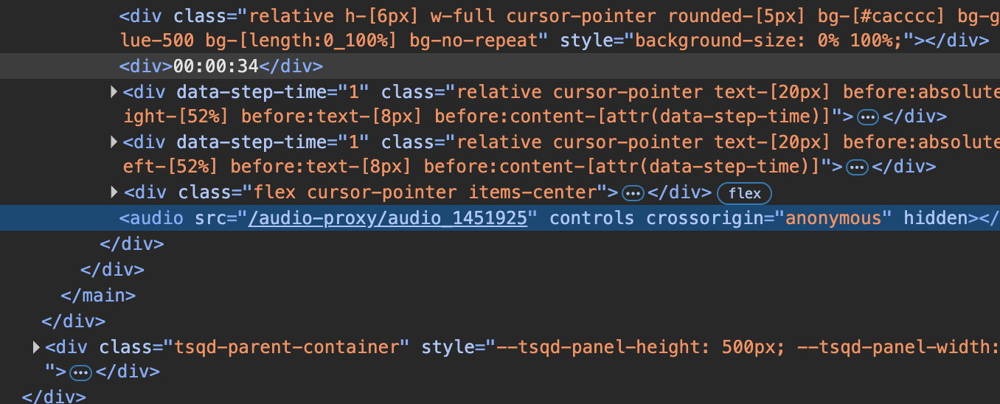

### Preface

為了能支援網頁播放，相信大家第一時間都是將抓取到的音檔位置後面加上 `?token=xxxx` 這樣的方式來處理，這也是我們一開始的做法，能無痛直接使用瀏覽器原生 `<audio>` 標籤，它會直接幫你做音檔 Range 切片，對大音檔也有優勢，但這種做法給資安公司做滲透或弱掃時，會被認為是有資安漏洞的，因為這樣的做法會讓 token 很容易被截取到，進而導致資安上的問題。

### Thoughts

這邊我提供前後端兩種思路：

後端思路則是後端要提供 ticket 機制，而這邊我就不多做說明，每家公司也會有不同的流程圖，但這種做法也算是滿標配的的做法。

前端思路是將 token 放在 header 裡面，或是將 token 放在 body 裡面，這兩種方式都可以避免 token 被截取到的問題，但這兩種方式都會有一個問題，就是瀏覽器的 `<audio>` 標籤並不支援這兩種方式，所以我們需要想辦法來解決這個問題。

### Frontend Solution

> 這邊需注意，在使用前端解決方案時，由於會使用到 service worker，假設如果你們公司主要會使用未授權的自簽憑證，這樣會導致 service worker 無法啟動成功，所以這邊需先確認這點，以免做白工。

錯誤的訊息會類似：

_Service Worker registration failed: SecurityError: Failed to register a ServiceWorker for scope ('https://xxx') with script ('https://xxx/audioServiceWorker.js'): An SSL certificate error occurred when fetching the script._

不熟悉 service worker 的話，可以參考 MDN 的[介紹](https://developer.mozilla.org/en-US/docs/Web/API/Service_Worker_API/Using_Service_Workers)。

> 簡單講就是我們會使用 service worker 來攔截音檔的請求，然後在攔截到請求後，將 token 加入到 header 裡面，這樣就可以避免 token 被截取到的問題。

那我們就開始執行了，我這邊是使用 React + Vite + TypeScript 來做示範。

首先我們先設定 service worker

```bash
# if you use typescript install required service worker types
pnpm install -D @types/serviceworker
```

```json
// tsconfig.json
{
  "compilerOptions": {
    "types": [
      "@types/serviceworker"
    ]
  },
}
```

```ts
// vite.config.ts
// 路徑部分請自行調整，像我自己是將 service worker 放在 src/workers 目錄下
// 下面是我簡單寫的範例
function devServiceWorkerPlugin(apiBase: string) {
  return {
    name: 'dev-service-worker',
    configureServer(server) {
      // 在開發模式下提供 service worker
      server.middlewares.use(
        '/audioServiceWorker.js',
        async (_req, res, _next) => {
          try {
            const swPath = path.resolve(
              __dirname,
              'src/workers/audioServiceWorker.ts',
            )

            // 使用 Vite 的 transformRequest 編譯 TypeScript
            const result = await server.transformRequest(swPath, {
              ssr: false,
            })

            if (result) {
              res.setHeader('Content-Type', 'application/javascript')
              res.setHeader('Service-Worker-Allowed', '/')
              res.setHeader(
                'Cache-Control',
                'no-cache, no-store, must-revalidate',
              )
              res.setHeader(
                'Strict-Transport-Security',
                'max-age=63072000; includeSubDomains; preload',
              )
              res.setHeader(
                'Content-Security-Policy',
                `default-src 'self'; script-src 'self'; connect-src 'self' ${apiBase}; worker-src 'self'`,
              )
              res.end(result.code)
            } else {
              throw new Error('Failed to transform service worker')
            }
            // eslint-disable-next-line @typescript-eslint/no-unused-vars
          } catch (_) {
            // console.error('Service Worker compilation failed:', error)
            // 返回一個最小的錯誤 service worker
            res.setHeader('Content-Type', 'application/javascript')
            res.statusCode = 200 // 保持 200 狀態，避免註冊失敗
            res.setHeader(
              'Strict-Transport-Security',
              'max-age=63072000; includeSubDomains; preload',
            )
            res.setHeader(
              'Content-Security-Policy',
              `default-src 'self'; script-src 'self'; connect-src 'self' ${apiBase}; worker-src 'self'`,
            )
            // console.error('Service Worker compilation failed: ${error?.message}');
            res.end(`
              self.addEventListener('install', () => self.skipWaiting());
              self.addEventListener('activate', () => self.clients.claim());
            `)
          }
        },
      )
    },

    // 處理熱更新
    handleHotUpdate({ file, server }) {
      if (file.includes('audioServiceWorker.ts')) {
        console.log('🔄 Service Worker file changed, triggering reload...')
        // 可以選擇全頁重載或通知客戶端重新註冊
        server.ws.send({
          type: 'full-reload',
        })
        return []
      }
    },
  }
}

export default ({ mode }) => {
  process.env = { ...process.env, ...loadEnv(mode, process.cwd()) }
  const apiBase = mode === 'development' ? process.env.VITE_APP_BASE_API : ''

  return defineConfig({
    plugins: [
      react(),
      devServiceWorkerPlugin(apiBase),
    ],
    build: {
      rollupOptions: {
        input: {
          main: path.resolve(__dirname, 'index.html'),
          audioServiceWorker: path.resolve(
            __dirname,
            'src/workers/audioServiceWorker.ts',
          ),
        },
        output: {
          entryFileNames: (chunk) =>
            chunk.name === 'audioServiceWorker'
              ? 'audioServiceWorker.js'
              : 'assets/[name]-[hash].js',
        },
      },
    }
  })
}
```

開始撰寫核心 service worker 及 hook

```ts
// audioServiceWorker.ts
interface AuthMessage {
  type: 'SET_AUTH_TOKEN'
  token: string
}

interface ClaimClientsMessage {
  type: 'CLAIM_CLIENTS'
}

interface AudioMappingMessage {
  type: 'SET_AUDIO_MAPPING'
  mapping: Record<string, string>
}

type ServiceWorkerMessage =
  | AuthMessage
  | ClaimClientsMessage
  | AudioMappingMessage

let authToken: string | null = null
let audioMapping: Record<string, string> = {}

self.addEventListener('install', (event: ExtendableEvent) => {
  console.log('📦 Service Worker installing...')
  event.waitUntil(self.skipWaiting())
})

self.addEventListener('activate', (event: ExtendableEvent) => {
  console.log('🚀 Service Worker activating...')
  event.waitUntil(
    self.clients.claim().then(() => {
      console.log('✅ Service Worker now controlling all clients')
    }),
  )
})

// 這邊我們使用 fetch 事件來攔截音檔請求
self.addEventListener('fetch', (event: FetchEvent) => {
  const url = new URL(event.request.url)
  // 只處理我們的音檔代理請求
  if (url.pathname.startsWith('/audio-proxy/')) {
    event.respondWith(handleAudioProxy(event.request))
  }
})

self.addEventListener('message', (event: ExtendableMessageEvent) => {
  const data = event.data as ServiceWorkerMessage

  if (data.type === 'SET_AUTH_TOKEN') {
    authToken = data.token
  } else if (data.type === 'CLAIM_CLIENTS') {
    event.waitUntil(
      self.clients.claim().then(() => {
        console.log('✅ Service Worker now controlling all clients')
      }),
    )
  } else if (data.type === 'SET_AUDIO_MAPPING') {
    audioMapping = data.mapping
  }
})

async function handleAudioProxy(request: Request): Promise<Response> {
  try {
    if (!authToken) {
      return new Response('No auth token available', { status: 401 })
    }

    const url = new URL(request.url)
    // 從 URL 中取得 audioId
    const audioId = decodeURIComponent(
      url.pathname.replace('/audio-proxy/', ''),
    )

    // 從映射中取得真實路徑 (checkmarx 之類的源碼弱掃會有 SSRF (Server-Side Request Forgery) 相關問題，故採用 mapping 方式)
    // audioMapping 會有點類似：[audioId]: 'https://example.com/path/to/audio/file.mp3' 
    // 使用此方式去規避 SSRF 問題
    const audioPath = audioMapping[audioId]
    if (!audioPath) {
      return new Response('Audio not found', { status: 404 })
    }

    // 攔截到後，建立新的 headers，加入認證，你也可以將 token 放到 body 裡面
    const headers = new Headers()
    headers.set('Authorization', `Bearer ${authToken}`)

    // 保留原始請求的 Range header（用於音檔 seeking）
    const rangeHeader = request.headers.get('Range')
    if (rangeHeader) {
      headers.set('Range', rangeHeader)
    }

    // 發送請求到真實的音檔 URL
    const response = await fetch(audioPath, {
      method: request.method,
      headers: headers,
    })

    return response
  } catch (error) {
    return new Response('Audio proxy failed', { status: 500 })
  }
}
```

```ts
// useAudioServiceWorker.ts
import { useEffect, useRef, useCallback, useState } from 'react'

interface AuthMessage {
  type: 'SET_AUTH_TOKEN'
  token: string
}

interface AudioMappingMessage {
  type: 'SET_AUDIO_MAPPING'
  mapping: Record<string, string>
}

interface UseAudioServiceWorkerOptions {
  workerPath?: string
  autoRegister?: boolean
}

interface UseAudioServiceWorkerReturn {
  isRegistered: boolean
  isSupported: boolean
  isReady: boolean
  updateAuthToken: (token: string) => void
  updateAudioMapping: (mapping: Record<string, string>) => void
  register: () => Promise<void>
  unregister: () => Promise<void>
}

export function useAudioServiceWorker(
  options: UseAudioServiceWorkerOptions = {},
): UseAudioServiceWorkerReturn {
  const { workerPath = '/audioServiceWorker.js', autoRegister = true } = options

  const registrationRef = useRef<ServiceWorkerRegistration | null>(null)
  const [isRegistered, setIsRegistered] = useState<boolean>(false)
  const [isReady, setIsReady] = useState<boolean>(false)
  const isSupported = 'serviceWorker' in navigator

  // 檢查 Service Worker 是否準備好
  const checkReady = useCallback(async () => {
    if (!isSupported) return false

    try {
      const registration = await navigator.serviceWorker.ready
      const ready =
        !!registration.active && !!navigator.serviceWorker.controller
      setIsReady(ready)
      return ready
    } catch (error) {
      console.error('Service Worker ready check failed:', error)
      setIsReady(false)
      return false
    }
  }, [isSupported])

  // 發送訊息到 Service Worker
  const sendMessageToServiceWorker = useCallback(
    async (message: AuthMessage | AudioMappingMessage): Promise<void> => {
      if (!isSupported) {
        console.warn('Service Worker not supported')
        return
      }

      try {
        const registrations = await navigator.serviceWorker.getRegistrations()

        for (const registration of registrations) {
          console.log('🔍 Checking registration:', {
            scope: registration.scope,
            hasActive: !!registration.active,
            activeState: registration.active?.state,
          })

          if (
            registration.active &&
            registration.active.state === 'activated'
          ) {
            registration.active.postMessage(message)
            console.log('✅ Message sent to Service Worker:', message.type)
            return
          }
        }

        console.warn('❌ No activated Service Worker found')
      } catch (error) {
        console.error('❌ Failed to send message to Service Worker:', error)
      }
    },
    [isSupported],
  )

  // 註冊 Service Worker
  const register = useCallback(async (): Promise<void> => {
    if (!isSupported) {
      console.warn('Service Worker not supported')
      return
    }

    if (isRegistered) {
      console.log('Service Worker already registered')
      return
    }

    try {
      const registration = await navigator.serviceWorker.register(workerPath)
      registrationRef.current = registration
      setIsRegistered(true)
      console.log('Service Worker registered successfully')

      // 檢查準備狀態
      await checkReady()
    } catch (error) {
      console.error('Service Worker registration failed:', error)
      throw error
    }
  }, [workerPath, isSupported, isRegistered, checkReady])

  // 卸載 Service Worker
  const unregister = useCallback(async (): Promise<void> => {
    if (registrationRef.current) {
      try {
        await registrationRef.current.unregister()
        registrationRef.current = null
        setIsRegistered(false)
        setIsReady(false)
        console.log('Service Worker unregistered')
      } catch (error) {
        console.error('Failed to unregister Service Worker:', error)
        throw error
      }
    }
  }, [])

  // 更新認證 token
  const updateAuthToken = useCallback(
    async (token: string): Promise<void> => {
      const message: AuthMessage = {
        type: 'SET_AUTH_TOKEN',
        token,
      }
      await sendMessageToServiceWorker(message)
    },
    [sendMessageToServiceWorker],
  )

  // 更新音檔映射
  const updateAudioMapping = useCallback(
    async (mapping: Record<string, string>): Promise<void> => {
      const message: AudioMappingMessage = {
        type: 'SET_AUDIO_MAPPING',
        mapping,
      }
      await sendMessageToServiceWorker(message)
    },
    [sendMessageToServiceWorker],
  )

  // 初始化
  useEffect(() => {
    if (!isSupported) return

    checkReady().then(() => {
      console.log('Initial Service Worker ready check complete')
    })

    // 如果已經有 controller，表示已經有 SW 在運行
    navigator.serviceWorker.getRegistration().then((reg) => {
      if (reg?.active) {
        reg.active.postMessage({ type: 'CLAIM_CLIENTS' })
      }
    })

    // 監聽 controller 變化
    const handleControllerChange = async () => {
      console.log('Controller changed')
      await checkReady() // 重新檢查狀態
    }

    navigator.serviceWorker.addEventListener(
      'controllerchange',
      handleControllerChange,
    )

    return () => {
      navigator.serviceWorker.removeEventListener(
        'controllerchange',
        handleControllerChange,
      )
    }
  }, [isSupported, checkReady])

  // 自動註冊
  useEffect(() => {
    if (autoRegister) {
      register().catch(console.error)
    }
  }, [autoRegister, register])

  return {
    isRegistered,
    isSupported,
    isReady,
    updateAuthToken,
    updateAudioMapping,
    register,
    unregister,
  }
}
```

使用上面兩個 hook 搭配你現有的程式，成功處理完後你就會看到很酷的效果，就是這網址有點怪異但是卻能正常播放音檔😂。



### Conclusion

以上就是我在處理需要驗證的音檔時，所採用的前端解決方案，雖然這個方案會增加一些複雜度，但卻能有效避免資安上的問題，當然我個人還是比較建議還是採用後端的 ticket 機制會比較好，因為只要使用上 service worker 前端就會比較沒有彈性，譬如有些客戶是使用內網，所以他們不見得有合格的 SSL 憑證，難道要放棄他們的案子嗎？所以使用時請依據你們公司的狀況來決定。

不過當然也有好處，就是身為前端其實可以不用太依賴後端，前端可以很大程度的將如何使用音檔的邏輯都包在前端，這樣也能減少後端的負擔。

這部分的資訊也算是滿少的，網路上也沒有太多相關的文章，所以希望這篇文章能幫助到有需要的朋友們。
