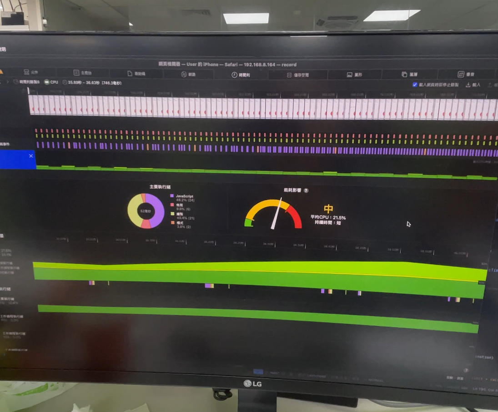

### Preface

先講結論，其實最終我是捨棄掉 waveSurfer 的，改使用 canvas 自己畫。

那這篇主要是使用 2018 年的 iphone XR 手機來進行測試，目前手機網頁在渲染方面會有點劣勢，尤其是像使用 requestAnimationFrame 這種，以畫面幀數來進行渲染，儘管越高可以有越絲滑的效果，但是我個人觀測，由於某些原因 waveSurfer.js 看起來似乎沒法正常的 gc，所以假設我錄的音檔越長，所停掉整個 process 的時間也就越長。

這邊可以參考一下影片，可以看到當我執行下去後，他需要等待相當久的時間才會有做動，使用者體驗相當的差，那我會透過幾種方式去做調整

<video style='width: 100%;' autoplay loop muted playsinline>
  <source src='../../../src/assets/audio-wavesurfer.webm' type='video/webm' />
  <source src='../../../src/assets/audio-websurfer.mp4' type='video/mp4' />
</video>

### Switch RequestAnimationFrame to SetTimeout

首先我最早是使用 requestAnimationFrame，手機 cpu 會消耗大約 30% 左右，其實不是很理想，如何開啟 Safari 監控可參考這篇 [文章](https://memorysd2013.github.io/2022/03/09/check-mobile-devtool-on-pc/)，接著開啟開發者工具，時間列去錄製畫面運算及使用率，如果使用 requestAnimationFrame 你會發現截圖會異常密集，這邊會建議如果您還是想用 waveSurfer.js 的話，使用 setTimeout 100ms 或著 200ms 去遞迴更新會是比較好的方案 100ms 大約是一秒 10 幀，而 200ms 則是一秒 5 幀...依此類推。

下面是程式範例

```ts
const useRecord = () => {
  const audioContextRef = useRef<AudioContext | null>(null)

  const handleRecord = async (currentAudioDevice: string | null) => {
    if (!currentAudioDevice) return

    if (!audioContextRef.current) {
      audioContextRef.current = new AudioContext({ sampleRate: SAMPLE_RATE })
    }

    await audioContextRef.current.resume()

    const mediaStream = await handleGetUserMediaPermission(
      false,
      currentAudioDevice
    )

    if (mediaStream) {
      setAudioChunk([]) // reset audio chunk when record
      setStream(mediaStream)

      try {
        await audioContextRef.current.audioWorklet.addModule(
          RecordProcessorWorklet
        )
      } catch (error) {
        console.error("audioWorklet.addModule error: ", error)
      }

      const microphone =
        audioContextRef.current.createMediaStreamSource(mediaStream)

      const node = new AudioWorkletNode(
        audioContextRef.current,
        "record-processor",
        {
          channelCount: CHANNEL,
        }
      )

      node.port.onmessage = (e: MessageEvent<NodeMessageType>) => {
        if (e.data.eventType === NodeEventType.INT16ARRAY) {
          const { audioBuffer } = e.data
          setAudioChunk(prev => [...prev, audioBuffer])
        }
      }

      node.onprocessorerror = err => {
        console.error("AudioWorkletNode error:", err)
      }

      const analyser = audioContextRef.current.createAnalyser()
      const bufferLength = analyser.frequencyBinCount
      const dataArray = new Float32Array(bufferLength)

      const handleDrawWaveform = () => {
        if (!drawWaveform || !waveSurferRef.current) return

        analyser.getFloatTimeDomainData(dataArray)

        waveSurferRef.current?.load(
          "",
          [dataArray],
          DEFAULT_SCROLLING_WAVEFORM_WINDOW
        )

        waveformAnimationIdRef.current =
          requestAnimationFrame(handleDrawWaveform)
      }

      waveformAnimationIdRef.current = -1
      handleDrawWaveform()

      startRecordTimer()

      microphone
        .connect(analyser)
        .connect(node)
        .connect(audioContextRef.current.destination)
    }
  }

  return {
    handleRecord,
  }
}
```

### Observe

雖然改成 setTimeout 去減少運算的確可以減少最後等待的時間，但我調整成 200ms 也就是一秒 5 幀後，後續的下降幅度就沒有那麼大，錄製 10 分鐘的音檔，requestAnimation 需等待 2x 多秒而 100ms 跟 200ms 則需等待大約 12 至 15 秒，所以效果也不盡理想，錄越久等待的時間仍會拉長。

感覺在手機中 js 沒辦法在有限的時間內 gc 掉，gc 執行可以透過 safari 開發者工具 JavaScript 與事件那欄進行觀察，橘色的方塊代表 js 有進行部分回收。



### Keep Going

所以接著我又對程式碼進行修正，主要有兩點，首先我將 waveSurfer.js 整個移除，改成使用 canvas 進行繪製，第二點則是 AudioContext 要可以進行複用，簡單講就是停止錄音時，我只將其閒置，要用時再復原就好，接著我也降低 audioContext 的 analyser，fftSize 傅立葉調整成 256，減少 canvas 渲染的數量。

```ts
audioContext.resume() // 複用
audioContext.suspend() // 閒置
```

所以最終程式碼會變成像

```ts
import { useEffect, useState, useRef, useCallback } from "react"
import RecordProcessorWorklet from "@/worker/record-processor?worker&url"
import { toast } from "sonner"

export enum NodeEventType {
  INT16ARRAY = "int16Array",
}

export interface Int16ArrayEvent {
  eventType: NodeEventType.INT16ARRAY
  audioBuffer: Int16Array
}

export type NodeMessageType = Int16ArrayEvent

const CHANNEL = 1
const SAMPLE_RATE = 16000
const TIMER_INTERVAL = 1000

const constraintsDefault: MediaStreamConstraints = {
  video: false,
  audio: {
    channelCount: CHANNEL,
    noiseSuppression: false, // 降噪
    sampleRate: SAMPLE_RATE,
  },
}

export const handleConvertRecordTime = (time: number) => {
  const hour = Math.floor(time / 3600)
  const minute = Math.floor((time % 3600) / 60)
  const second = Math.floor((time % 3600) % 60)

  return `<span ${hour === 0 ? "style='color: #e8e8e8'" : ""}>${
    hour < 10 ? "0" + hour : hour
  }:</span>
    <span ${minute === 0 ? "style='color: #e8e8e8'" : ""}>${
    minute < 10 ? "0" + minute : minute
  }:</span>${second < 10 ? "0" + second : second}`
}

const useRecord = (drawWaveform: boolean = false) => {
  const initMicrophonePermissionRef = useRef(true)
  const [mediaPermission, setMediaPermission] = useState(false)

  const [stream, setStream] = useState<MediaStream | null>(null)
  const audioContextRef = useRef<AudioContext | null>(null)
  const analyserRef = useRef<AnalyserNode | null>(null)
  const microphoneRef = useRef<MediaStreamAudioSourceNode | null>(null)
  const nodeRef = useRef<AudioWorkletNode | null>(null)
  const [audioChunk, setAudioChunk] = useState<Int16Array[]>([])
  const waveformAnimationIdRef = useRef<number | null>(null)
  const timerIntervalIdRef = useRef<ReturnType<typeof setInterval>>()
  const [recordTime, setRecordTime] = useState(0)

  const adjustRecordTime = handleConvertRecordTime(recordTime)

  const startRecordTimer = () => {
    stopRecordTimer() // clear previous timer if exist
    setRecordTime(0)

    timerIntervalIdRef.current = setInterval(() => {
      setRecordTime(prev => prev + 1)
    }, TIMER_INTERVAL)
  }

  const stopRecordTimer = () => {
    if (timerIntervalIdRef.current) clearInterval(timerIntervalIdRef.current)
  }

  const cleanupStream = useCallback(() => {
    stream?.getTracks().forEach(track => track.stop())
    setStream(null)
  }, [stream])

  const cleanupWaveform = useCallback(() => {
    if (waveformAnimationIdRef.current) {
      clearTimeout(waveformAnimationIdRef.current)
      waveformAnimationIdRef.current = null

      const canvas = document.getElementById("waveform") as HTMLCanvasElement
      const ctx = canvas.getContext("2d")
      ctx?.clearRect(0, 0, canvas.width, canvas.height)
    }
  }, [])

  const cleanupAudioNode = useCallback(() => {
    if (microphoneRef.current) {
      microphoneRef.current.disconnect()
      microphoneRef.current = null
    }

    if (nodeRef.current) {
      nodeRef.current.disconnect()
      nodeRef.current = null
    }

    if (analyserRef.current) {
      analyserRef.current.disconnect()
      analyserRef.current = null
    }
  }, [])

  const handleCloseStream = useCallback(async () => {
    stopRecordTimer()
    cleanupWaveform()
    cleanupAudioNode()

    // this just suspend
    if (audioContextRef.current?.state === "running") {
      await audioContextRef.current.suspend()
    }

    cleanupStream()
  }, [cleanupStream, cleanupWaveform, cleanupAudioNode])

  const handleRecord = async (currentAudioDevice: string | null) => {
    if (!currentAudioDevice) return

    if (!audioContextRef.current) {
      audioContextRef.current = new AudioContext({ sampleRate: SAMPLE_RATE })

      try {
        await audioContextRef.current.audioWorklet.addModule(
          RecordProcessorWorklet
        )
      } catch (error) {
        console.error("audioWorklet.addModule error: ", error)
      }
    }

    if (audioContextRef.current.state === "suspended") {
      await audioContextRef.current.resume()
    }

    const mediaStream = await handleGetUserMediaPermission(
      false,
      currentAudioDevice
    )

    if (mediaStream) {
      setAudioChunk([]) // reset audio chunk when record
      setStream(mediaStream)

      if (!microphoneRef.current) {
        microphoneRef.current =
          audioContextRef.current.createMediaStreamSource(mediaStream)
      }

      if (!nodeRef.current) {
        nodeRef.current = new AudioWorkletNode(
          audioContextRef.current,
          "record-processor",
          {
            channelCount: CHANNEL,
          }
        )

        nodeRef.current.port.onmessage = (e: MessageEvent<NodeMessageType>) => {
          if (e.data.eventType === NodeEventType.INT16ARRAY) {
            const { audioBuffer } = e.data
            setAudioChunk(prev => [...prev, audioBuffer])
          }
        }

        nodeRef.current.onprocessorerror = err => {
          console.error("AudioWorkletNode error:", err)
        }
      }

      if (!analyserRef.current) {
        analyserRef.current = audioContextRef.current.createAnalyser()
        analyserRef.current.fftSize = 256
        const bufferLength = analyserRef.current.frequencyBinCount
        const dataArray = new Float32Array(bufferLength)

        const canvas = document.getElementById("waveform") as HTMLCanvasElement
        canvas.height = 180
        const ctx = canvas.getContext("2d")

        const handleDrawWaveform = () => {
          if (!drawWaveform || !ctx || !analyserRef.current) return

          // Clear the canvas
          ctx.clearRect(0, 0, canvas.width, canvas.height)

          // Get audio data
          analyserRef.current.getFloatTimeDomainData(dataArray)

          // Begin drawing
          ctx.beginPath()
          const sliceWidth = canvas.width / dataArray.length
          let x = 0

          for (let i = 0; i < dataArray.length; i++) {
            const value = (dataArray[i] + 1) / 2 // Normalize between 0 and 1
            const y = value * canvas.height

            if (i === 0) {
              ctx.moveTo(x, y)
            } else {
              ctx.lineTo(x, y)
            }

            x += sliceWidth
          }

          ctx.lineTo(canvas.width, canvas.height / 2) // Complete the waveform
          ctx.strokeStyle = "#72869f" // Waveform color
          ctx.lineWidth = 2
          ctx.stroke()

          waveformAnimationIdRef.current = setTimeout(handleDrawWaveform, 100)
        }

        waveformAnimationIdRef.current = -1
        handleDrawWaveform()
      }

      startRecordTimer()

      microphoneRef.current
        .connect(analyserRef.current)
        .connect(nodeRef.current)
        .connect(audioContextRef.current.destination)
    } else {
      toast.error("無法取得麥克風音訊，請重整頁面")
    }
  }

  const handleGetUserMediaPermission = async (init = false, deviceId = "") => {
    if (deviceId) {
      ;(constraintsDefault.audio as MediaTrackConstraints).deviceId = {
        exact: deviceId,
      }
    }

    try {
      const mediaStream = await navigator.mediaDevices.getUserMedia(
        constraintsDefault
      )

      if (init) {
        mediaStream.getTracks().forEach(track => track.stop())
      } else {
        return mediaStream
      }
      setMediaPermission(true)
    } catch (error) {
      console.error(`handleGetUserMediaPermission error: `, error)

      toast.error("請允許瀏覽器存取麥克風，否則無法錄音", {
        duration: Infinity,
        closeButton: true,
      })
    }
  }

  // init get microphone permission
  useEffect(() => {
    if (initMicrophonePermissionRef.current) {
      void handleGetUserMediaPermission(initMicrophonePermissionRef.current)
    }

    return () => {
      initMicrophonePermissionRef.current = false
    }
  }, [])

  // visibilitychange change
  useEffect(() => {
    const handleClose = async () => {
      await handleCloseStream()
      await audioContextRef.current?.close()
      audioContextRef.current = null
    }

    const handleVisibleChange = async () => {
      if (document.visibilityState === "hidden") await handleClose()
    }

    document.addEventListener("beforeunload", handleClose)
    document.addEventListener("visibilitychange", handleVisibleChange)

    return () => {
      document.removeEventListener("beforeunload", handleClose)
      document.removeEventListener("visibilitychange", handleVisibleChange)
    }
  }, [handleCloseStream])

  // leave page close toast, and close stream record
  useEffect(() => {
    return () => {
      if (stream) {
        const handleLeavePage = async () => {
          await handleCloseStream()
          await audioContextRef.current?.close()
          audioContextRef.current = null
        }

        handleLeavePage()
      }

      toast.dismiss()
    }
  }, [handleCloseStream, stream])

  return {
    handleRecord,
    handleCloseStream,
    stream,
    audioChunk,
    setAudioChunk,
    adjustRecordTime,
    setRecordTime,
    mediaPermission,
    audioContextRef,
  }
}

export default useRecord
```

修改過後，點擊結束錄音後，就可以很快的結束處理中的畫面，省去 10 幾秒的等待時間，達到預期的效果。

### Conclusion

此篇主要是紀錄我在手機上處理音效渲染遇到的一些效能問題，那我是如何嘗試去解決的，畢竟手機的資源的確比較有限，主管又想要有該功能，而站在公司的角度也不大可能強迫客戶只使用效能好且最新版本的手機來使用公司的產品。

waveSurfer.js 仍是一個很好的繪製聲音振幅的套件，他提供許多套件可以做使用，但是當功能不需要如此複雜時，其實可以選擇不去使用；我自己是認為，可以在桌機版本使用該套件提供比較豐富的功能，接著在手機版如果遇到效能瓶頸時，跟設計師討論，簡化一些功能，透過程式的方式讓他只使用單純的 canvas 來進行繪製，或許是不錯的解決方案。
