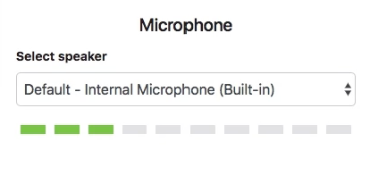

### Preface

坦白說這部分的資料在網路上資源比較匱乏一點，不然就是沒有提供比較詳細的解釋，單純只有程式碼而已，所以需要自己去理解為何要這樣做，程式碼的部分我是參考 Google Chrome Lab github 的 [連結](https://github.com/GoogleChromeLabs/web-audio-samples/commit/7c109d7d21c24bfa031f843877837e36ea0028cb)。

_補充: 上方參考連結的程式碼會使用 JavaScript class private syntax, 像是: `#lastUpdate` `#volume`...等，請不要覺得難，加上 # 的值，只是不可被外部讀取而已，順帶一提，TypeScript private syntax 仍可以被外部讀取。_

```javascript
class Hello {
  #name

  constructor() {
    this.#name = "World"
  }
}

console.log(new Hello().#name)
// error: Property '#name' is not accessible outside class 'Hello' because it has a private identifier.
```

### Introduce AudioWorklet initialize

還記得上次的語音辨識專案嗎？這是 AudioWorklet 初始化範例，如下：

```javascript
class VolumeMeter extends AudioWorkletProcessor {
  static get parameterDescriptors() {
    return []
  }

  constructor() {
    super()
  }

  process(inputs, outputs, parameters) {
    return true
  }
}
```

### Jump into Volume meter

當 `process` 被觸發時，我們將 inputs 的值帶入 `calculateVolume` 的函數內，接著我們要統計左聲道跟右聲道的值並加總後取平均值，這邊我們使用 _平方平均数(rms)_ 的方式來進行加總(這方式在聲音取值方面是滿常做使用的)，將左右聲道各 128 個 float32array 數組相乘加總並除以 128 再開更號，求得該時間點平均的音量強度。

```javascript{10-21,24}
class VolumeMeter extends AudioWorkletProcessor {
  static get parameterDescriptors() {
    return []
  }

  constructor() {
    super()
  }

  calculateVolume(inputs) {
    const inputChannelData = inputs[0][0]
    let sum = 0

    // Calculate the squared-sum.
    for (let i = 0; i < inputChannelData.length; ++i) {
      sum += inputChannelData[i] * inputChannelData[i]
    }

    // Calculate the RMS level and update the volume.
    const rms = Math.sqrt(sum / inputChannelData.length)
  }

  process(inputs, outputs, parameters) {
    this.calculateVolume(inputs)

    return true
  }
}
```

### Next Step

接著我們添加 `SMOOTHING_FACTOR` 這項參數，這項參數是一個滑動平均的參數，我們將該值設為 0.8，這樣我們就可以把音量的強度慢慢更新，而不是直接更新。

有些人對這步驟會產生困惑，我這邊解釋一下，假設上次 rms 我們取得的值是 10 好了，下一次取得的值是 0 ，透過 `Math.max(rms, this.volume * SMOOTHING_FACTOR)`，這樣下一次的值就會變成 8 而不是直接變成 0 ，那因為 process 的觸發是毫秒等級的，透過這種方式可以有漸進式的降低音量的感覺。

```javascript{1,10,25}
const SMOOTHING_FACTOR = 0.8

class VolumeMeter extends AudioWorkletProcessor {
  static get parameterDescriptors() {
    return []
  }

  constructor() {
    super()
    this.volume = 0
  }

  calculateVolume(inputs) {
    const inputChannelData = inputs[0][0]
    let sum = 0

    // Calculate the squared-sum.
    for (let i = 0; i < inputChannelData.length; ++i) {
      sum += inputChannelData[i] * inputChannelData[i]
    }

    // Calculate the RMS level and update the volume.
    const rms = Math.sqrt(sum / inputChannelData.length)

    this.volume = Math.max(rms, this.volume * SMOOTHING_FACTOR)
  }

  process(inputs, outputs, parameters) {
    this.calculateVolume(inputs)

    return true
  }
}
```

### Final Step

最後我們這邊是想要每 16ms 才派送一次值給前端進行渲染，這邊有一個 currentTime 參數可以做使用，該值不用額外做宣告，作法簡單講就是每次觸發都要扣掉上一次的值，如果區間大於 16ms 便會進行觸發。

至於為何 `this.volume` 最後要乘以 100 在於 rms 的值大部分在 0.1 以下，而我前端要渲染的格子只有 10 格，所以我將 rms 乘以 100 確保值的落點。

```javascript{11,28-34}
const SMOOTHING_FACTOR = 0.8

class VolumeMeter extends AudioWorkletProcessor {
  static get parameterDescriptors() {
    return []
  }

  constructor() {
    super()
    this.volume = 0
    this.lastUpdate = currentTime
  }

  calculateVolume(inputs) {
    const inputChannelData = inputs[0][0]
    let sum = 0

    // Calculate the squared-sum.
    for (let i = 0; i < inputChannelData.length; ++i) {
      sum += inputChannelData[i] * inputChannelData[i]
    }

    // Calculate the RMS level and update the volume.
    const rms = Math.sqrt(sum / inputChannelData.length)

    this.volume = Math.max(rms, this.volume * SMOOTHING_FACTOR)

    // Post a message to the node every 16ms.
    if (currentTime - this.lastUpdate > 0.016) {
      this.port.postMessage({ eventType: "volume", volume: this.volume * 100 })

      // Store previous time
      this.lastUpdate = currentTime
    }
  }

  process(inputs, outputs, parameters) {
    this.calculateVolume(inputs)

    return true
  }
}
```

### Frontend Example

最後再補上一點點前端的範例 code，這部分我就不額外敘述，畢竟每個人使用方式不同。

```html
<div class="volume-group">
  <div class="volume-cell"></div>
  <div class="volume-cell"></div>
  <div class="volume-cell"></div>
  <div class="volume-cell"></div>
  <div class="volume-cell"></div>
  <div class="volume-cell"></div>
  <div class="volume-cell"></div>
  <div class="volume-cell"></div>
  <div class="volume-cell"></div>
  <div class="volume-cell"></div>
</div>

<script>
  const volumeCells = document.querySelectorAll(".volume-cell")

  /**
   * 該函數用來處理 volume cell 顏色變化事件
   */
  function handleVolumeCellColor() {
    const allVolumeCells = [...volumeCells]
    const numberOfCells = Math.round(volume)
    const cellsToColored = allVolumeCells.slice(0, numberOfCells)

    for (const cell of allVolumeCells) {
      cell.style.backgroundColor = "#e3e3e5"
    }

    for (const cell of cellsToColored) {
      cell.style.backgroundColor = "#79c545"
    }
  }
</script>
```

##### 最後附上成果展示的圖。



### Conclusion

_該功能需要去了解數學平方平均数，這部分因為我之前在公司其他專案已經有使用過了，那時專案印象中是後台 API 需使用 Java 轉換左右聲道音波，為此還去研究了一下 Java 要怎寫 😅 ，所以比較不會困惑，有興趣可以自行上網搜尋平方平均數通常使用在什麼時機上。_

最後，由於網路上對音效處理的資源較為匱乏，希望大家能透過我的解釋，了解為何要這樣去做實作，並能多學習到一點東西，那我們下篇文章再見啦，如果我有想法的話 😅 。
