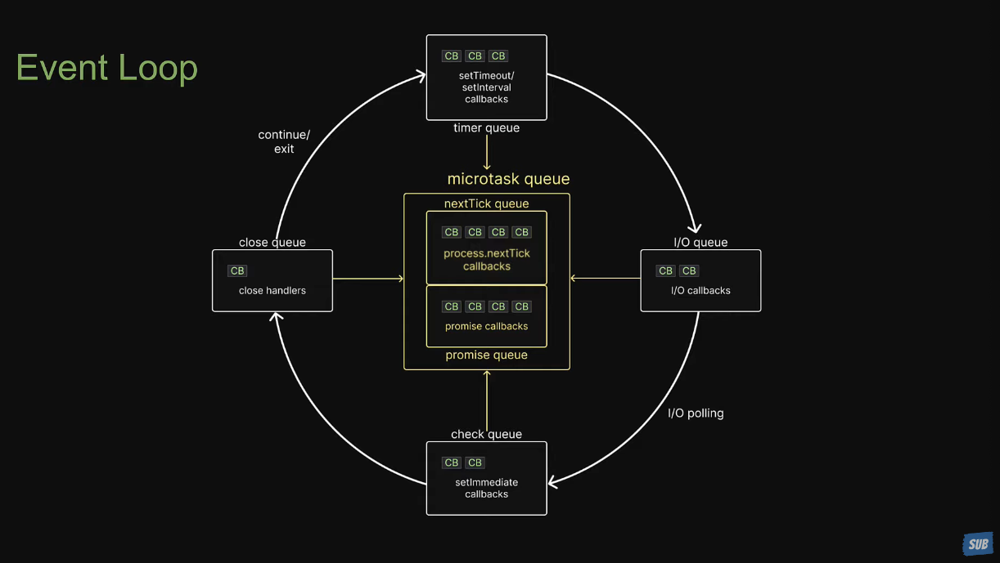

### Preface

阻塞(blocking)，是指在作業系統(operation system，簡稱 OS)中，當系統等待操作完成，接著才允許程式碼繼續執行，用戶在此等待期間無法執行其他任務；相反，非阻塞(non blocking)，則是允許執行緒繼續執行，無需等待該操作完成，不會影響其他進程。

### Asynchronous programming

在 JavaScript 中，異步是很重要的一個概念，為何說他重要，各位可以試想一下，如果 network request 也就是我們常說的 call API 的這行為是阻塞的，執行完一個才執行下一個，而不是在執行時平行去跟後台要檔案，一隻 API 一秒，十隻 API 就十秒，使用者使用的體感及實際效能是不是會相當的差。

所以我們可以說 JavaSciprt 是一個 Asynchronous Programming Language，但異步的程式語言也就意味著，會有很多 callback (回調函式)，如果 API 的邏輯很複雜，就有可能會產生所謂的 callback hell (回調函式地獄)，如下方程式碼。

```js
asyncFunction1(param1, function (result1) {
  asyncFunction2(result1, function (result2) {
    asyncFunction3(result2, function (result3) {
      asyncFunction4(result3, function (result4) {
        // Nested callback continues...
      })
    })
  })
})
```

程式碼會一層一層的非常的深，那要如何緩解這一現象呢？

### Promise or Async/Await

使用 Promise 後我們的程式碼會像

```js
asyncFunction1(param1)
  .then(result1 => asyncFunction2(result1))
  .then(result2 => asyncFunction3(result2))
  .then(result3 => asyncFunction4(result3))
  .then(result4 => {
    // Handle final result
  })
  .catch(error => {
    // Handle any errors
  })
```

而使用 async/await 後我們程式碼會像

```js
try {
  const result1 = await asyncFunction1(param1)
  const result2 = await asyncFunction2(result1)
  const result3 = await asyncFunction3(result2)
  const result4 = await asyncFunction4(result3)
  // Handle final result
} catch (error) {
  // Handle any errors
}
```

**基本上 async/await 這語法糖是建立在 Promise 上，讓我們有種寫起來跟讀起來很像同步 (synchronous) 的程式碼，但事實上並非如此，他並不會造成阻塞，其他程式同時仍會照常執行。**

但你或許又有疑問，JavaScript 不是一個單線程語言嗎？在這限制底下，這語言一段時間只能執行一段程式碼，JavaScript 有一個很重要的東西叫做 event loop，基本上執行都是依照這個規則來，簡單來講就是讓程式去排隊，圖示會如下：


<br />

我個人相當相當建議去看這個 youtube，會對理解這門語言有幫助。

<iframe width="560" height="315" src="https://www.youtube.com/embed/L18RHG2DwwA?si=UFxLoP-uJKv49pDt" title="YouTube video player" frameborder="0" allow="accelerometer; autoplay; clipboard-write; encrypted-media; gyroscope; picture-in-picture; web-share" allowfullscreen></iframe>

### Conclusion

以上是我自己理解的範疇，希望對讀者有幫助，題外話，有興趣可以去看一下 v8 engine，他是 google 寫的 c++ 專案，用來編譯 JavaScript，[連結在這](https://github.com/v8/v8)。
