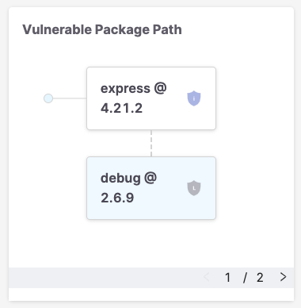
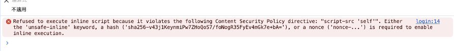
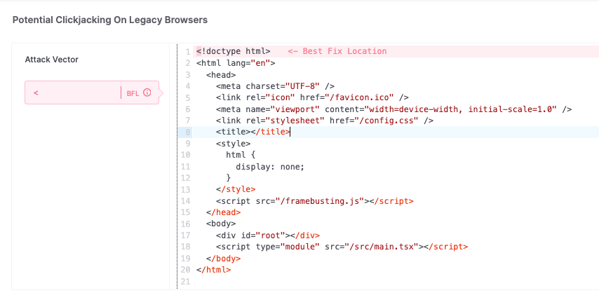
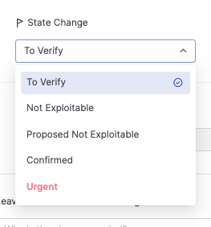

### Preface

本文章範例使用 vite + react 做 SPA，後端搭配 expressjs。

首先我必須講 Checkmarx 源碼的弱掃是一個非常大的坑，很多其實是你解不掉的，舉個例子，各位使用 nodejs 開發伺服，應該或多或少都會使用 expressjs 這套 lib 吧。

`express@4.21.2` 及其全家桶 `morgan@1.10.0` `compression@1.8.0`，也是我在寫這篇文章當下的最新版本，這三個 lib 在 Checkmarx 會有 SCA 的 low issue，原因是這三個 lib 還在使用 `debug@2.6.9`。

這部分目前 express 的團隊沒打算更新，原因在這邊有敘述 [參考](https://github.com/expressjs/morgan/issues/294)。題外話，你在 package.json 使用 resolutions 或 overrides 是沒用的，Checkmarx 是針對 lib。

附上其中一張，顯示版本不夠的圖。


<br>
<br>

所以解法有什麼呢？

1. 最好的方式，當然是 PM 要能說服客戶，會建議是一開始就要談不能將 issue 清 0，且要有彈性空間，但這也取決於 PM 的能力，坦白說目前我們公司遇到的廠商都踩得很硬。
2. 乾脆不使用，但這不合邏輯，搞不好你開發很久了，就因為這個解不掉就不用太奇怪了。
3. 所以最終你可能要自己 fork 下來更新。

### Potential Clickjacking on Legacy Browsers

接著我們來解這個滿知名的弱點，在舊版的瀏覽器，攻擊者在目標網站鑲嵌一個透明的 iframe，誘導用戶點擊網頁，並觸發惡意程式，所以在 react 中，你可以在 index.html 內進行添加

```html
<!DOCTYPE html>
<html lang="en">
  <head>
    <meta charset="UTF-8" />
    <link rel="icon" href="/favicon.ico" />
    <meta name="viewport" content="width=device-width, initial-scale=1.0" />
    <title>React</title>
    <style>
      html {
        display: none;
      }
    </style>
    <script>
      if (self === top) {
        document.documentElement.style.display = "block"
      } else {
        // 這段程式碼的作用是當頁面被鑲嵌在 iframe 中時 (即 self !== top)
        // top.location = self.location 是將頂層頁面的 url 設置為當前頁面的 url，從而可以從 iframe 中跳出
        top.location = self.location
      }
    </script>
  </head>
  <body>
    <div id="root"></div>
    <script type="module" src="/src/main.tsx"></script>
  </body>
</html>
```

掃描後 Checkmarx 沒有錯誤訊息了，一切都很美好，但是當你將前端伺服跑起來時，頁面整片白白的，console 會跳警告


<br>

簡而言之，因為伺服 CSP 的關係，這部分也是因為 **弱掃所以必須強制添加**，不能使用 inline code

```ts
// 拿 express 並使用 helmet 來進行添加 CSP
app.use(
  helmet({
    contentSecurityPolicy: true,
  })
)
```

由於不能使用 inline code，所以聰明的你立馬想到將程式碼放到 public 資料夾了對吧

```html
<script src="/framebusting.js"></script>
```

搞定，再扔進去掃描


<br>

🤯

講結論，Checkmarx 其實只是去檢查 `*.html` 裡面有沒有 `if (self === top) {...} else {...}` 的程式碼，所以儘管你有引用，它還是沒用，各位就知道很坑了吧？

### Brainstorming

所以要怎麼解決呢？既要能 inline code，且也要能 bypass CSP 的規則。

其實 script 有一個 nonce (Number used once) 這東西，用於標示每次頁面載入時允許執行的程式碼，但這必須透過伺服器並搭配前端去設定。

如果想更深一點的去了解可以參考 Will 保哥的 [文章](https://blog.miniasp.com/post/2023/12/22/Inline-script-and-CSP-settings-nonce-hash)

我們來改寫 html

```html
<script nonce="<%= nonce %>">
  if (self === top) {
    document.documentElement.style.display = "block"
  } else {
    top.location = self.location
  }
</script>
```

接著在伺服端

```ts
// server.ts
import express, { Response } from "express"
import helmet from "helmet"
import { join } from "path"
import { readFile } from "fs/promises"

const app = express()

/**
 * ---------------------------------------
 * Middleware
 * ---------------------------------------
 */
app.use((_req, res, next) => {
  // Generate a random nonce for each request
  // you can use crypto.js ... etc to generate nonce
  res.locals.nonce = "random123"
  next()
})

// secure app by setting various HTTP headers
app.use(
  helmet({
    contentSecurityPolicy: {
      useDefaults: true,
      directives: {
        "script-src": [
          "'self'",
          (_req, res) => {
            // res type is ServerResponse<IncomingMessage>,
            // so you need to cast it to express Response
            const typedRes = res as Response
            return `'nonce-${typedRes.locals.nonce}'`
          },
        ],
      },
    },
  })
)

/**
 * ---------------------------------------
 * Serve static file
 * ---------------------------------------
 */
app.use((req, res, next) => {
  // prevent serving index.html automatically
  if (req.path === "/" || req.path.endsWith(".html")) {
    return next()
  }

  // pass the request to the next middleware function
  express.static(join(__dirname, "..", "public"))(req, res, next)
})

app.get("*", async (_req, res) => {
  try {
    const indexPath = join(__dirname, "..", "public", "index.html")
    let html = await readFile(indexPath, "utf8")

    // Replace <%= nonce %> with the actual nonce
    html = html.replace("<%= nonce %>", res.locals.nonce || "")

    res.setHeader("Content-Type", "text/html")
    res.send(html)
  } catch (err) {
    console.error("Error serving index.html:", err)
    res.status(500).send("Internal Server Error")
  }
})
```

扔進去 Checkmarx 掃描後，弱點消失，實際運行起來也是可以的。

### Conclusion

其實我覺得解決弱掃問題很吃經驗，你處理了某個弱點，但處理的方式又間接去影響了你解決其他弱點的情況；重點是，其實這種還算是比較簡單的 😅，有些情況更為複雜。

最後 Checkmarx 是有提供可以改變狀態的選項，如果當這個弱點可被認定為沒有風險，工程師可以將其標注其為 Not Exploitable。


<br>

但是客戶同不同意又是另一件事。😂
