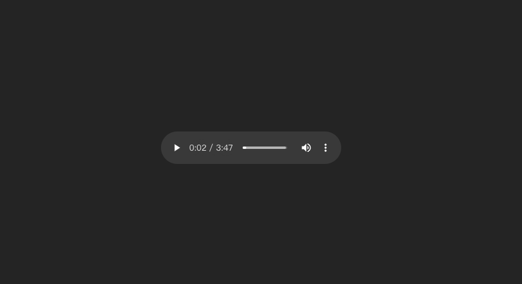

### Preface

坦白說我自己平常也不大使用 Web Component，大部分的情況還是盡可能的都會使用 React Functional Component 的方式將功能寫好，畢竟維護上還是有優勢在，但我自己認為某些情況很適合使用 Web Component，像是瀏覽器讓人詬病的預設 audio player 的樣式，或是一些較為獨立的元件...等，那也因為 Web Component 原生的特性，他可以依附在任何你想用的專案及任何前端框架上，相對減少很多開發成本。

### Let's Build simple audio web component

廢話不多說，我們就直接來建置吧，這邊我們先用 vite 創建一個新的 react 專案，`yarn vite create audio-web-component --template react-ts`。

首先我們將 `src/App.tsx` 的內容改成下面這樣：

```tsx
// App.tsx
import './App.css'
import './web-component/AudioPlayer'
import music from './assets/music.mp4' // 請自行換成你想要的音樂並放到 assets 資料夾中

function App() {
  return (
    <div className="App">
      <audio-player src={music} />
    </div>
  )
}

export default App
```

接著我們來建立 `web-component` 資料夾，並且在裡面建立 `AudioPlayer.ts`，這邊我們先來建立一個簡單的 audio player 模板。

```ts
// web-component/AudioPlayer.ts
{
  class AudioPlayer extends HTMLElement {
    constructor() {
      super();
      this.attachShadow({ mode: "open" });

      this.render()
    }

    // 這邊我們先只監聽 src 的變化
    static get observedAttributes() {
      return ["src"]
    }

    // 當 src 屬性有變化時，我們就重新 render
    attributeChangedCallback(name: string, oldValue: any, newValue: any) {
      if (name === "src") {
        this.render()
      }
    }

    elStyle() {
      return `
        <style></style>
      `
    }

    render() {
      if (this.shadowRoot) {
        this.shadowRoot.innerHTML = `
          ${this.elStyle()}
          <audio src="${this.getAttribute('src')}" controls></audio>
        `
      }
    }
  }

  // 避免重複註冊導致錯誤
  if (!customElements.get("audio-player")) {
    customElements.define("audio-player", AudioPlayer);
  }
}
```

這時我想你的 React 因為 typescript 的關係，應該在報錯了，錯誤訊息為

> Property 'xxx' does not exist on type 'JSX.IntrinsicElements'.

所以我們需要在 `src` 資料夾下建立 `global.d.ts`，並且在裡面加入下面的程式碼。

```ts
// global.d.ts
import * as React from 'react'

declare global {
  namespace JSX {
    interface IntrinsicElements {
      // 請依據需求來進行修改
      'audio-player': React.DetailedHTMLProps<React.HTMLAttributes<HTMLElement, HTMLAudioElement>, HTMLElement, HTMLAudioElement>;
    }
  }
}
```

這時畫面如果沒有問題的話應該會有一個瀏覽器預設的播放器了。


<br>

接著我要來加入一顆按鈕，簡單做個功能可以控制播放器的播放與暫停。

```ts
{
  class AudioPlayer extends HTMLElement {
    #audio: HTMLAudioElement | null = null;
    #playPauseBtn: HTMLButtonElement | null = null;
    #audioCtx: AudioContext | null = null;
    #gainNode: GainNode | null = null;
    #track: MediaElementAudioSourceNode | null = null;

    constructor() {
      super();
      this.attachShadow({ mode: "open" });

      this.render()
    }

    // 這邊我們先只監聽 src 的變化
    static get observedAttributes() {
      return ["src"]
    }

     // 當 src 屬性有變化時，我們就重新 render
    attributeChangedCallback(name: string, oldValue: any, newValue: any) {
      if (name === "src") {
        this.render()
      }
    }

    // 初始化 audio context
    initialAudio() {
      if (!this.#audio) return

      this.#audioCtx = new AudioContext();
      this.#gainNode = this.#audioCtx.createGain();
      this.#track = this.#audioCtx.createMediaElementSource(this.#audio);

      this.#track
        .connect(this.#gainNode)
        .connect(this.#audioCtx.destination);
    }

    attachEvents() {
      this.#playPauseBtn!.addEventListener("click", this.playPauseAudio.bind(this), false);

      this.#audio!.addEventListener(
        "ended",
        () => {
          this.#playPauseBtn!.textContent = "play";
        },
        false
      );
    }

    async playPauseAudio() {
      if (!this.#audio) return

      if (this.#audioCtx?.state === "suspended") {
        this.initialAudio();
        await this.#audioCtx.resume(); 
      }

      if (this.#audio.paused) {
        this.#audio.play();
        this.#playPauseBtn!.textContent = 'pause';
      } else {
        this.#audio.pause();
        this.#playPauseBtn!.textContent = 'play';
      }
    }

    elStyle() {
      return `
        <style>
          .audio {
            display: hidden;
          } 
        </style>
      `
    }

    render() {
      if (this.shadowRoot) {
        this.shadowRoot.innerHTML = `
          ${this.elStyle()}
          <div class="audio-web-component">
            <button id="playPauseBtn">play</button>
            <audio src="${this.getAttribute('src')}" class="audio"></audio>
          </div>
        `

        this.#audio = this.shadowRoot.querySelector(".audio");
        this.#playPauseBtn = this.shadowRoot.querySelector("#playPauseBtn");

        this.attachEvents();
      }
    }
  }

  // 避免重複註冊導致錯誤
  if (!customElements.get("audio-player")) {
    customElements.define("audio-player", AudioPlayer);
  }
}
```

之後你使用的時候只要在 html 中加入 `<audio-player src="你的音樂路徑"></audio-player>` 就可以使用了，當然你還可以依據自己的需求去做添加舉例來說你想要有音量控制或著是播放進度條...等，我這邊只演示該如何實作功能而已。


<br>

### Conclusion

在寫這篇文章時，我也有做一些功課及思考，那我自己滿認同這篇文章所寫的大部分優缺點 [網站連結](https://www.foo.software/posts/will-web-components-replace-react)，我認為滿值得參考的。

我自己現階段是認為，除非元件是需要跨框架做使用時，才有必要使用該技術，不然就是當網站發展到較大規模時，才需要將某些較為獨立的元件抽出來，使用 Web Component 來進行實作，規模不大時，我認為使用 React 或是 Vue 來進行開發，會是比較好的解決方案，也可以更好的專注在開發上面，心智負擔也會比較小，像是你不用自己手寫一個 Proxy 代理去監聽某些事情，或著 cache 某些值...等。至於如果真的網站真的遇到效能瓶頸，需要高效能，我可能第一時間會想到的是使用 Web Assembly，而不是 Web Component，不過這些就純粹是我自己個人的想法嚕。😅

順帶一提在寫 Web Component 時有一個不錯的套件叫做 [lit](https://lit-html.polymer-project.org/)，可以讓你在寫 Web Component 時，使用類似 React 的 JSX 語法，及一些好用的 decorator，有興趣也可以使用看看。
