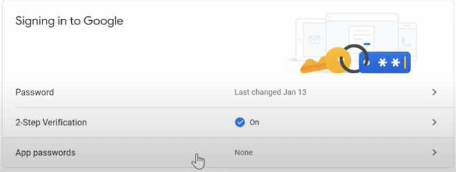
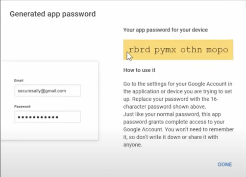

### Brainstorming

由於這框架我沒有太多使用上的經驗，外加由於先前維護的後端工程師未將 config.php 內 `$config['log_threshold']` 設定為 1 (可以將錯誤信息打印出來的模式)，所以我這邊很快的設定了一下。

```php
// config.php
$config['log_threshold'] = 1; // default 0
// can identify the error message log file path
$config['log_path'] = '/home/path/to/application/logs/';
```

設定完成後，再將 `$config['log_path']` 的路徑權限使用此指令 `chmod -R 775 /home/path/to/application/logs/` 設定為可讀寫，並且重新啟動 Apache 服務。

之後再重新寄信做測試，便會發現資料夾內會有錯誤訊息顯示，順著錯誤訊息得知，大概率不是因為程式碼太舊導致寄信失敗，於是我著手開始查看是否為 Google 方面的問題，後來發現，我們原先用來寄信的 Google 帳戶 2FA 是開啟的，關於此部分，也不知道是公司同仁不小心開啟的，還是 Google 那邊會自動幫忙設定，外加若未開啟 2FA，低安全性應用程式存取權是無法進行開啟的，測試過後發現兩個可能由於 Google 的政策，導致這兩個是連動的。

錯誤訊息會類似這樣：

```
Message: fsockopen(): SSL operation failed with code 1. OpenSSL Error messages: error:14090086:SSL routines:SSL3_GET_SERVER_CERTIFICATE:certificate verify failed
FileName: libraries/Email.php
```

### How to solve

所以這時你就必須要使用應用程式密碼，這個密碼是可以在 Google 帳戶的安全性頁面產生，產生後就可以使用這個密碼來寄信了，如附圖所示。

點擊「應用程式密碼」，選擇「其他」，並且輸入應用程式名稱，之後就會產生一組密碼，這組密碼就是你要使用的密碼。


<br>

我們將下方黃色的密碼複製起來。


<br>

回到 CodeIgniter 的 config.php，將 `$config['smtp_pass']` 改為剛剛產生的密碼，此部分也有人未使用 config.php 來統一管理參數，而是直接寫在程式碼內，這時就必須去 event.php 搜尋 send_email 的 function，並將 smtp_pass 密碼改成剛剛產生的密碼，並且重新啟動 Apache 服務，再次寄信，便會成功寄出信件。

### Conclusion

公司有比較老舊的程式，時常會有類似這種問題，外加，有些地方沒有做到很好的管理，像是公司 Google 帳戶的更動或修改，只好下去看程式錯誤去尋找問題，所以這次的問題就是這樣解決的，希望這篇文章可以幫助到大家。
