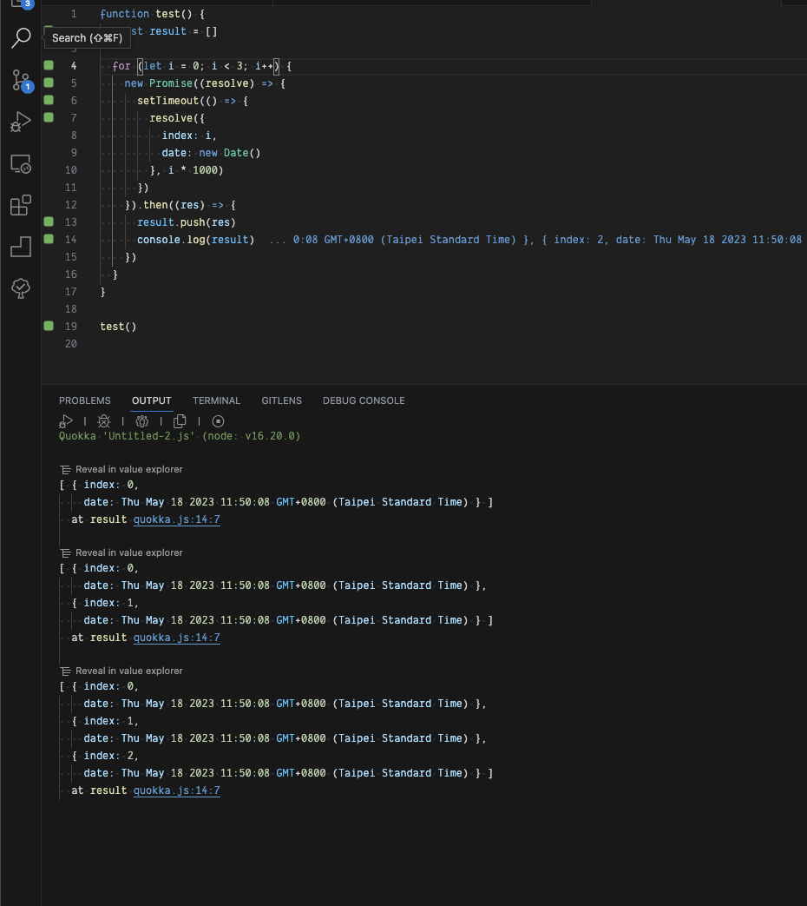

### Preface

要如何優雅的上傳大量的檔案呢？這是一個很常見的問題，但是大多數的人都會用一個一個的上傳，這樣的方式，所以當上傳的檔案數量很多的時候，就會變得很慢，而且也不太好管理，所以今天就來寫一下如何優雅的上傳大量的檔案。

### Vue frontend code

下方是很簡單的上傳檔案的前端程式碼，這邊我有加上 `webkitdirectory`，讓使用者可以以選擇資料夾的方式進行上傳，這部分請依照自己的需求做修改。

後續我會將重點著重在 `handleFileChange` 這個 function 上面。

```ts
<script setup lang='ts'>
import { ref } from 'vue'

const inputRef = ref<HTMLInputElement>()

async function handleFileChange() {
  // how to upload multiple files
}
</script>

<template>
  <label for='file-input'>
    <input 
      id='file-input' 
      ref='inputRef' 
      type="file" 
      webkitdirectory
      multiple 
      @change="handleFileChange" 
      style='display: none' 
    />
    <button @click='inputRef?.click()'>Upload</button>
  </label>
</template>

<style lang='scss' scoped></style>
```

### How to upload multiple files

其實上傳檔案的重點就是，你對 `Promise` 這個物件，是否有更深一層的了解。

```ts
async function handleFileChange() {
  const files = (inputRef.value as HTMLInputElement).files

  if (files) {
    // 由於 files 是一個 FileList 物件，所以我們若想要使用 array 的方式操作他，需要將它轉成陣列
    // 接著就可以用下方的方式做你需要的事情，當然你也可以單純的使用 for loop 來做
    const fileList = Array.from(files)
      .filter(file => {
        if (file.name.startsWith('.')) return false // 濾掉 .DS_Store 這種檔案
        if (file.type !== 'image/jpeg') return false // 濾掉非 jpeg 的檔案
        return true
      })
      .map(...)

    if (fileList.length !== 0) {
      try {
        // 解決方式一，也是大部分人都會使用的方式
        // 很簡單的上傳檔案，但是這樣的方式，會讓上傳的檔案變得很慢
        // 要等到前面結束，後面才會開始
        for (let i = 0; i < fileList.length; i++) {
          const file = fileList[i]
          const formData = new FormData()
          formData.append('file', file)
          await uploadFile(formData)
        }
    
        // 解決方式二，使用 Promise.all 來加速上傳的速度
        // 最大的原因是因為我們不需要等到上傳完一個檔案之後，才能上傳下一個檔案
        // 且上一次的上傳，不會影響且這一次的上傳，也就是順序不重要
        const BATCH = 20; // 我們每 20 個檔案一組，進行上傳
        const promises = [] as Promise<void>[]
        for (let i = 0; i < fileList.length; i++) {
          const file = fileList[i]
          const formData = new FormData()
          formData.append('file', file)
    
          // create promise then push into promises
          const promise = async () => {
            await uploadFile(formData)
          }
          promises.push(promise())
    
          if (promises.length === BATCH || i === fileList.length - 1) {
            await Promise.all(promises)
            promises = []
          }
        }
  
        // 解決方式三
        // 但是使用 Promise.all 來加速上傳的速度，也有一個缺點，就是假設裡面有一個檔案上傳失敗，
        // 整個流程就會變得很麻煩，而這時我們可以使用 Promise.allSettled 來解決這個問題，輸出時他會多一個 status 參數
        const BATCH = 20 // 我們每 20 個檔案一組，進行上傳
        const promises = [] as Promise<void>[]
        for (let i = 0; i < fileList.length; i++) {
          const file = fileList[i]
          const formData = new FormData()
          formData.append('file', file)
    
          // create promise then push into promises
          const promise = async () => {
            await uploadFile(formData)
          }
          promises.push(promise())
    
          if (promises.length === BATCH || i === fileList.length - 1) {
            const res = await Promise.allSettled(promises)
            // [{ status: 'fulfilled', value: undefined }, { status: 'rejected', reason: 'error' }]
            // 接著你就可以做更多後續的處理
            res.some(item => item.status === 'rejected') && throw new Error(`upload file error`)
            promises = []
          }
        }
      } catch (error) {
        console.log(error)
      } finally {
        //
      }
    } else {
      //
    }
  }
}
```

### Disadvantage by using Promise.all and Promise.allSettled

上述我們使用了 `Promise.all` 及 `Promise.allSettled` 來上傳多檔，也是作者我建議使用的方式，但是使用這兩個方式也是有缺點的，假使我們上傳檔案的大小是如下：

```
music1.mp4 (25MB)
music2.mp4 (25MB)
music3.mp4 (100GB) <-- upload slow
music4.mp4 (25MB) <-- 而這個檔案其實是有問題的，ex: error format music file
music5.mp4 (25MB)
```

缺點就是必須要等到 batch 達到我們指定的數量，才會回傳結果，也就是說要等待 100GB 的檔案上傳完成，僅管 25MB 的檔案上傳有問題且已經報錯了，這情況其實是比較不樂觀的，而這時其實就可以回歸原點使用 `uploadFile.then().catch()` 的方式來進行處理，儘管使用此方法比較複雜，但好處是假使你在 batch 區間執行時已經發現錯誤，並想要 cancel 掉後續 API 的執行，甚至可以搭配 `AbortController` 來進行處理，因為比較複雜，下方僅是示意的程式碼及圖片，後續就交給讀者自己去實作了。

```ts
async function handleFileChange() {
  let result = []
  const batch = 3

  for (let i = 0; i < 6; i++) {
    new Promise((resolve) => {
      setTimeout(() => {
        resolve({
          index: i,
          date: new Date()
        }, i * 1000)
      })
    }).then((res) => {
      result.push(res)
      if (result.length % batch === 0) {
        result = []
      }
    }).catch((error) => {
      //
    })
  }
}
```

<br>

### Conclusion

在做公司內部的一些網站時，總會遇到這些奇奇怪怪的事情，像是有需求是要上傳超過 1000 個檔案之類的奇耙操作，總結一下，上傳檔案的重點其實就是，你對 `Promise` 這個物件，是否有更深一層的了解，希望對讀者能有所收穫。