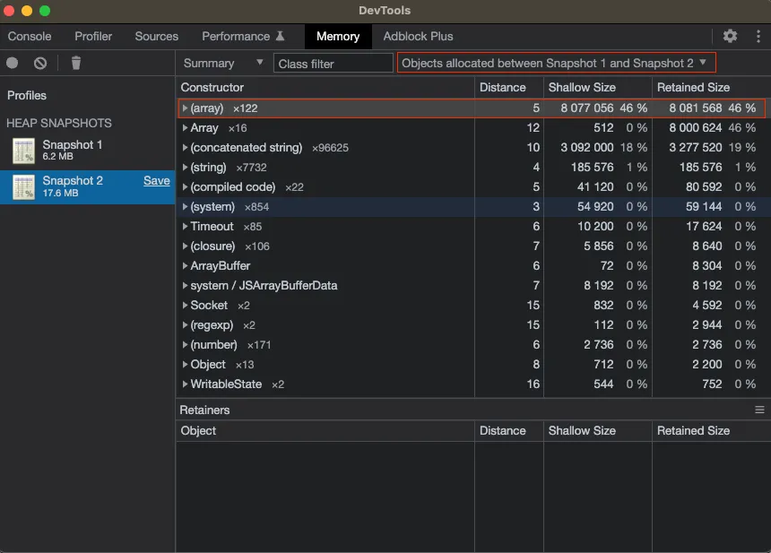

### Preface

首先，先科普一下，nodejs 是 single thread，儘管你的主機有複數顆 cpu(nodejs 可以透過`os.cpus().length`來查看)，運行時，也只會使用到其中一個；但有些情況下，你的確需要使用複數個 cpu 來進行處理，這時你便需要使用到 cluster module 來進行處理，更細節的部分，可以參考該[youtube教學](https://www.youtube.com/watch?v=SHR-KmfRIsU&list=PLC3y8-rFHvwh8shCMHFA5kWxD9PaPwxaY&index=61)，我認為解釋的相當不錯。

切回正題，所以當你運行的 nodejs 程式時，cpu 吃到100%，就會導致程式執行緩慢，甚至無法正常運行，這時候你就需要找出問題所在，並解決它。

### How to fix the problem

在寫 nodejs 時，為了讓某些參數能複用，所以時常會宣告一些參數在 function 外，下面是範例：

```typescript
let interval = ReturnType<typeof setInterval>();
const DELAY_TIMEOUT_MS = 1000;

function highCPUUsageFn() {
  //...
}

export function startInterval() {
  interval = setInterval(() => {
    highCPUUsageFn()
  }, DELAY_TIMEOUT_MS);
}

export  function stopInterval() {
  clearInterval(interval);
}
```

假使你的程式在某些特殊情況，恰巧無法觸發 stopInterval 時，該 interval 便不會被 nodejs garbage collection 回收，若好死不死 interval 內又是一個需要跑迴圈很耗 cpu 的程式，那麼你的 cpu 就會被吃光光了，這種是滿常出現的情況。

第二種情況是，對程式較不理解，像是 Buffer：

```typescript
let buffer = Buffer.alloc(0);

// while, for, or any other loop, websocket, etc.
for (let i = 0; i < 6000000; i++) {
  buffer = Buffer.concat([buffer, Buffer.from("a")])
}
```

這種情況也是不好的，因為 `Buffer.concat` 每次運行都是產生一個全新 buffer，當 buffer 的量越來越大或運行次數太過頻繁時，會造成 cpu 使用率過高，像是在處理音訊時，在這種情況我們可以先宣告一個比較大的 buffer ，接著將音訊的 buffer 依照各自的 offset 寫進去，會是一個比較好的方案：

```typescript
const totalSize = 1024 * 1024; // Total size of the big buffer in bytes (1 MB in this example)
const chunkSize = 4096; // Size of each chunk in bytes

// Create a big buffer with the specified total size
const bigBuffer = Buffer.alloc(totalSize);

// Loop to assign 4096 size chunks into the big buffer
for (let offset = 0; offset < totalSize; offset += chunkSize) {
  const chunk = Buffer.alloc(chunkSize);

  // You can fill the chunk with data here if needed
  // For example, you can use chunk.fill(0) to fill it with zeros, or copy data from another buffer

  // Copy the chunk into the big buffer at the specified offset
  chunk.copy(bigBuffer, offset);
}
```

其實我個人滿推薦第三方套件來處理 Buffer，相當不錯的一個套件是 [bl](https://www.npmjs.com/package/bl)，它可以幫你處理 buffer 上的問題，底層是使用 array 來貯存 Buffer，相比於上面的方法，更為簡潔：

```typescript
import { BufferList } from "bl";

const bl = new BufferList();

// while, for, or any other loop, websocket, etc.
for (let i = 0; i < 6000000; i++) {
  // 沒錯就是簡簡單單的 append，不會有每次都產生新的 buffer 的問題，也不需要自己處理 offset
  bl.append(Buffer.from("a")); 
}

bl.slice(0, 100); // 可以直接使用 slice 來取得 buffer
```

第三種情況則是，使用的套件有問題，這種情況就必須等待你使用的套件維護者有在持續維護該套件了，發 PR，或是你可以自己 fork 出來，自己維護，這種情況就相對比較麻煩了。

當然還有其他情況，像是其實你有運行 callback，但是你沒有讓 callback return 之類的，導致程式一直往下執行...等。

### How to detect the problem

要如何較快速的找到是哪裡出現問題，首先會先用 htop 確認，是否的的確確是 nodejs cpu 吃到很高，如果是，接著我個人會使用 node inspect 搭配 chrome inspect 來尋找程式上面的瑕疵。

```json
// package.json
{
  "script": {
    "watch": "tsc -w",
    "dev": "nodemon --delay 500ms dist/index.js",
    "dev:inspect": "nodemon --inspect=0.0.0.0:9229 --delay 500ms dist/index.js",
    "start": "concurrently \"npm run watch\" \"npm run dev\"",
    "start:inspect": "concurrently \"npm run watch\" \"npm run dev:inspect\""
  }
}
```

接著使用 snapshot 的功能，判別兩張 snapshot 之間的差異，圖片是從這篇 [Medium 文章](https://betterprogramming.pub/optimizing-node-js-performance-a-guide-to-detecting-memory-leaks-and-high-cpu-usage-cbdad77e7a98) 上面拿的，僅是示意而已：


<br>

### Conclusion

其實我自己實際遇到的情況是 `Buffer.concat` 的太過頻繁，導致 cpu 使用率過高，後來使用 bl 套件來解決掉了。坦白說，這種有時很難發現，因為我在這前一版本也是直接使用 `Buffer.concat`，卻沒有發生任何問題，新版本所新增的功能，我也不認為會導致高 cpu 這種情況，但是確實是發生了，有點弔詭，可能還是要持續觀察。

我個人目前還是覺得 nodejs 提供 debug 的方式還是不太友善，儘管已搭配 Typescript 強型別，eslint...等，但是在 memory debug 上還是頗為困難，期許後面有人能開發更有效率的 debug 工具。

推一下 Rust，由於 Rust 語言的特性，在 debug 上面就相當的友善，宣告的不對，或是沒清掉，甚至連跑都沒辦法跑，難怪近期深受許多工程師推崇。
