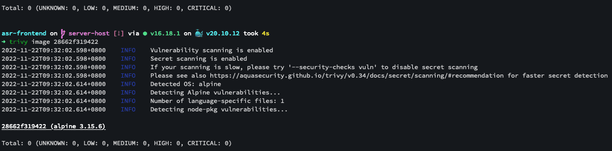

### What is NUC

NUC 你可以把它想像成是一個小型的電腦，那我們公司目前將它灌成 Linux ，並將它當成小型的主機來進行一些專案上的開發。

### Linux vs Mac

首先因為我們開發的系統需抓取 NUC 外接的硬體設備並封裝到 docker 內，而 Mac 在抓取硬體方面相當不友善，坦白講，抓不抓的到硬體設備可能都還是個問題 😅，所以相較下來，Linux 在這方面，就比較友善，大多數抓取硬體設備的方式也都有套件或 command line 去做配合，最終你可以在 docker 運行時透過 `--device` 將裝置的位置帶到 docker 內，供 docker 內所運行的程式去做使用。

雖然前面講那麼多，且我在開發上幾乎都會使用到 VIM，但是直接在 NUC 開發還是一件很麻煩的事情，且我們在 NUC 上也沒有灌 GUI 之類的系統，前端開發時網站的頁面也看不到，而最終我還是想在我的 Mac 上面做開發，畢竟 Mac 也是我最熟悉的開發工具，這那該怎辦呢？

### How to connect to the NUC

首先我們的 NUC 是有以太網卡及藍芽 Wifi 無線網路的，這邊你可以透過 `ifconfig` 去檢查；所以我是先將 NUC 用有線以太網路連結上網之後，並將 Mac 的 Wifi 連到 NUC 的 Wifi 上面達到使 Mac 能嫁接上網，那使用這樣的方式讓我也能無痛使用 SSH 的方式進入 NUC 的 terminal，對我來講，我覺得算是最簡單的解決方案 😅。

### Why I choose Vscode

因為 Mac 抓不到硬體裝置，那你要如何讓你在 Mac 上面開發遠端的專案呢？這時我就不得不佩服，Microsoft Vscode 套件的開發員了，你可以下載微軟官方 Remote 系列的相關套件來達到目標，安裝完成後你就可以透過 SSH 連進去並使用你自己本地端的 Vscode 來做開發，無須多做任何設置，相當的方便，目前我主要的遠端開發項目，我都是使用這套件在進行開發。

除了使用 VSCode，我也有嘗試使用 Jetbrain 家 Gateway 這套軟體，但是首先載入真的好久，還需下載一些東西，且套件似乎還有分遠端跟本地端，在開發上相對比較沒有那麼容易上手及友善，但畢竟我在使用時，Gateway 還是處在 Beta 的版本，期許他們之後他們會將缺點所改善。

### How to show frontend on the local browser

該專案我是使用 Vue 搭配 Vite 來進行開發，那要如何讓 Mac 的瀏覽器在 Vue 專案運行時能看到頁面呢？ 其實很簡單 vite 在運行時可以下 `--host`，[vite 官網](https://cn.vitejs.dev/config/#server-host) 對該指令的敘述是**指定服務器應該監聽哪個 IP 地址。如果將此設定為 0.0.0.0 或著 true 將監聽所有地址，包括區域網或公網地址**。所以我們便可以透過下面程式碼讓 Mac 本地端能正常顯示 NUC 內運行的前端專案。

```bash
yarn dev --host 0.0.0.0
```

### Docker optimization

能使用 Vscode Remote 套件讓你能輕鬆在本地端進行開發後，剩下就是程式撰寫方面惹，那這邊我就不多加贅述，畢竟是公司專案，所以讓我來講一下 Docker 吧。

Docker 是目前很多公司常常使用的虛擬化容器，使用它有很多優點，包含快速交付，擴充方便...等，那我們公司也是使用此來進行專案開發及擴充，與主管討論過，由於該專案之後會進行 OTA(Over-the-air programming) 即所謂**空中編程**，所以 Docker 的大小，傳輸時間成本都是必須考量的範圍，簡而言之， 檔案大小大小及後續因為程式修改會變更的 Docker layer 是越小越好。

所以首先我將專案架構改成下圖，將原本放在 backend 專案內的 frontend 專案資料夾整個拉出來，各自獨立，這在 docker layer 的部分可以減少 frontend 的程式碼，layer 也會比較乾淨，畢竟最後我只要 frontend build 出來 dist 的那包檔案，並將這包檔案放到 backend 的 layer 中。

```
project
⎣ frontend/
⎣ backend/
.dockerignore
.gitignore
.Dockerfile
```

我使用 nodejs alpine 的版本的 image 來減少 Docker 檔案的大小，這邊需注意使用 alpine 無法用 apt-get 來安裝相關套件，需使用 apk 指令來進行安裝，所以假設你的套件無法在 alpine 上面無法安裝及執行，可能需使用其他套件，或變更程式碼，這部分須你跟主管進行討論來達到最佳解，我就不多加贅述了，畢竟每個人專案的狀況不一樣。

那 Docker 也有一種機制是就算你在 Dockerfile 執行 `RUN rm -rf <some-file>`，你最終產出來的 image 大小也沒有變化的原因是，Docker 是用一層一層 layer 的形式來構築的(union file system)，所以你在 Docker 執行上述的程式碼，其實就是幫你在創建一個 layer ，並在那個 layer 上進行移除，前面的 layer 是未做變更的，所以最終顯示的檔案大小是不會有所變動的。

**補充：這邊可以稍微的去探討一下 `--squash` 這 Docker 指令，雖然目前該指令還在實驗中，但我相信如果技術夠成熟，應該可以大大減少許多不必要的檔案，[連結](https://docs.docker.com/engine/reference/commandline/build/#squash-an-images-layers---squash-experimental) 在這。**

```Dockerfile
FROM mhart/alpine-node:14 AS build
WORKDIR /usr/src/app
COPY frontend/package.json frontend/yarn.lock ./
RUN yarn
COPY frontend ./
RUN yarn build

FROM mhart/alpine-node:14 AS deps
WORKDIR /usr/src/app
COPY backend/package.json backend/yarn.lock ./
RUN yarn --production

FROM mhart/alpine-node:14 AS production-stage
WORKDIR usr/src/app
RUN apk update && \
	apk add <your-library>
COPY backend ./
COPY --from=deps /usr/src/app/node_modules ./node_modules
COPY --from=build /usr/src/app/dist ./public
EXPOSE 8000
CMD ["node", "index.js"]
```

最後便可以使用下方程式碼推上去 Docker Hub 來做存放。

```bash
docker build -t project-name .
docker tag project-name remote-project-name
docker push remote-project-name
```

### Additional information

題外話，假如你的專案相較於 OTA ，你們需要有較高的安全係數，需要經過弱點分析，像是金融產業、公司伺服器...等，有可能需要使用像是 trivy 這類的弱點偵測工具，這邊可以將 node 的 image 換成官方的來解決該問題，筆者這邊使用的是 node:16-alpine3.15；當然可能還是會有其他問題，像是有涉及 python，則建議使用 conda 來進行安裝，不然弱點偵測會有很多錯誤...等，這邊就不多加贅述了，有興趣的可以自行去研究。

下圖是用 trivy 測試完的結果，可以看一下結果。



### Conclusion

其實一開始以為不會太困難的專案，但在實際開發時還是有許多眉眉角角，像是原先我 Docker 產出來的檔案因為沒使用 alpine 版本，所以檔案大小在 2G 左右，之後慢慢調整現在大概 200mb 左右的檔案大小，alpine 無法使用的套件，也轉而撰寫程式或使用其他套件來替代，程式撰寫時產生的其他問題，因為硬體裝置的關係所以需要使用 SSH 到遠端，並在本地端開發...等，我認為這就是程式好玩及令人著迷的地方。

除了自己上網搜尋，並嘗試尋找最佳解外，同事也有提供一些協助，很感謝他們的協助。
