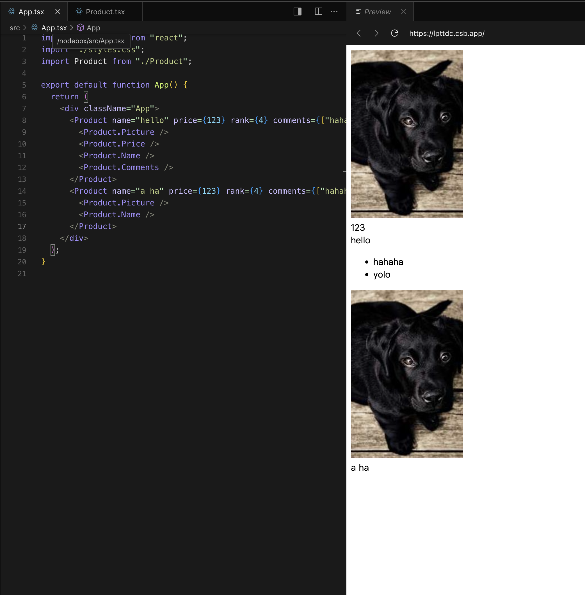

### Preface

Compound Component (復合元件) 是一個程式設計概念，他也出現在滿多的 lib 中，在 react 中尤其是 headleass UI component，他算是舉足輕重的角色，去年因為公司主管的要求，我將公司的部分網站，轉往使用 react，經過一番 search 後，我們的元件庫是使用 shacn ui，這套也是使用 compound component，所以今天我就來解釋一下這是什麼樣的設計理念。

### Goal

我覺得要使用某種方式去 coding，你最先需要知道目的是為何？我相信各位使用 react 應該有看過類似這種的程式碼。

```tsx
function Controller() {
  return (
    <Controller
      search={search}
      setSearch={setSearch}
      text={text}
      setText={setText}
      history={history}
      setHistory={setHistory}
      handleStep={handleStep}
      scroll={scroll}
      fontSize={fontSize}
      setFontSize={setFontSize}
      ...
    />
  )
}
```

其實這程式碼沒有不對，但假設這個 Controller 他在其他頁面需要*重復使用*，且在那個頁面不需要有修改 fontSize 的元件，一般的情況你會在拋一個 props 進去，像是 disableFontSize 他是個 boolean，或著你覺得需要做到每個功能都可控，所以也可以會去規劃有一個 disabledFeatures 然後他是 array，`["search", "history", "text", "fontSize"]`，類似這種方式去控制元件。

以上都是很好的解決方案，但還有一種設計思路是這樣，當你不要某個功能其實就將他移除掉，這樣程式碼會更精簡，這就是我今天想打得 Compound Component，的設計理念。

```tsx
function Controller() {
  return (
    <Controller>
      <Controller.Container>
        {/* <Controller.Text /> */}
        <Controller.Search />
        <Controller.History />
        <Controller.FontSize />
      </Controller.Container>
    </Controller>
  )
}
```

在 react 中，為了實現上述功能，會使用 context，來實作，這樣即使你的 component 元件有很多層嵌套的比較深，也不會有 props drilling 的問題出現，也方便元件 state 的集中管理，也不用每個元件都拋個 props 給他。

遵循這種設計思路，所以通常父層就是在定義 context，接著 Container 大部分則是定義元件的輪廓，這也取決於你想怎麼擺放，剩下的則是將不同的元件樣式及功能做抽離，這樣講有點籠統，我就實際實作看看。

### Hand Dirty

可以想像一個電商的商品圖，他會有圖片，價錢，商品名稱，評價...等，我身為一個工程師得去怎樣規劃呢？

```tsx
import React, { createContext, useContext, useState } from "react"

interface ProductContextType {
  picture?: string
  name: string
  price: number
  rank?: number
  comments?: string[]
}

const ProductContext = createContext<ProductContextType | null>(null)

function Product({
  children,
  picture,
  name,
  rank,
  price,
  comments,
}: {
  children: React.ReactNode
  picture?: string
  name: string
  price: string
  rank?: number
  comments?: string[]
}) {
  // state 的部分請看自身需求，如果只需要傳遞就不用定義 ex: name
  const [productPicture, _setProductPicture] = useState(
    picture ?? "https://picsum.photos/id/237/200/300"
  )
  const [productPrice, _setProductPrice] = useState(price ?? 0)
  const [productRank, _setProductRank] = useState(rank ?? 0)
  const [productComments, _setProductComments] = useState(comments ?? [])

  return (
    <ProductContext.Provider
      value={{
        picture: productPicture,
        name,
        price: productPrice,
        rank: productRank,
        comments: productComments,
      }}
    >
      {children}
    </ProductContext.Provider>
  )
}

function Container({ children }: { children: React.ReactNode }) {
  return <div className="p-2">{children}</div>
}

function Picture() {
  const { picture } = useContext(ProductContext) as ProductContextType

  return 
}

function Price() {
  const { price } = useContext(ProductContext) as ProductContextType

  return <div className="text-blue-500 font-bold">{price}</div>
}

function Name() {
  const { name } = useContext(ProductContext) as ProductContextType

  return <div className="font-bold">{name}</div>
}

function Ranking() {
  const { ranking } = useContext(ProductContext) as ProductContextType

  return <div className="font-bold text-red-500">{ranking}</div>
}

function Comments() {
  const { comments } = useContext(ProductContext) as ProductContextType

  return (
    <ul className="font-bold">
      {comments.map((comment, index) => (
        <li key={index}>{comment}</li>
      ))}
    </ul>
  )
}

Product.Container = Container
Product.Picture = Picture
Product.Name = Name
Product.Price = Price
Product.Ranking = Ranking
Product.Comments = Comments

export default Product
```

按照 compund component 的設計思路，我自己個人傾向會將其定義成上面這樣，效果如下圖：


<br />

你可以依據自己的需求去引入相對應的元件，需要時再將其引入就好。

### Conclusion

其實 compound component 這種設計思路，已經出現很久了，那為何我現在會想要寫這篇文章呢？原因在於，這就是我個人認為工程師現階段還不會被 AI 取代的原因之一，現階段的大語言模型基本上就是把 wireframe 甚至是功能一籮筐的打印出來，坦白說也的確滿厲害的，問一問問題就可以把簡單的 App 寫出來，但是大語言模型還是有瑕疵的，當你的元件是需要更具有彈性或可擴性時，A 要 link 到 B 時，這部分目前還是得由人類去推敲及規劃怎樣做，AI 給你的解不見得是最佳解，每家公司甚至是你自己的產品需求也都不同，由工程師去決定哪個是比較適合自己的解決方案。

不斷精進自己讓自己不會被 AI 取代是我認為目前工程師滿重要的課題。
