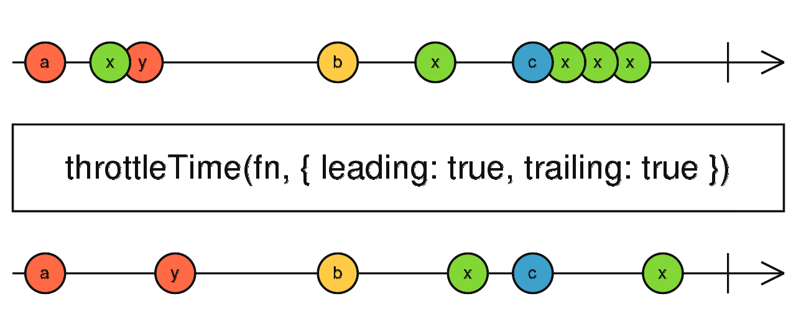

### Confuse

Throttle 跟 Debounce，究竟要如何區分呢？我相信很多剛接觸程式的工程師會搞混，我自己是這樣記的：

Throttle 是閥門的意思，可以把它想像成是日本庭院常常出現的流水竹筧，他的概念就是水太多時，他會將竹筧內的水倒到池子內，接著又回復原位，週而復始，當水注入的量很穩定，就會每隔一段準確的時間將水倒入池子內，定時地每隔一段時間就去做觸發最新一次的東西，減緩 function 執行的太過頻繁，使用場景會像是滑鼠滾動或著瀏覽器頁面 resize 時，可以拿來做性能優化使用。

Debounce 就是防手抖的意思，你可以想像你在短時間內抖了很多下，每次觸發都會去重新註冊一個 wait 等待的 timeout，你在等待的時間內若沒再次觸發，程式才會執行。使用場景會像是 google 的搜尋並顯示下方 dropdown 的功能，使用者輸入很快，但當使用者停下幾毫秒後 dropdown 才會顯示，並秀出所搜尋的結果。

> 那為何這兩樣東西很重要，最主要的點，在於它可以有效緩解伺服器 io 的問題，且使用者體驗也不會有所降低。

### Knowledge

在進入程式碼撰寫的部分前，有些 js 的基礎你可能要先知道。

js 有 `fn.apply`，`fn.call` 及 `fn.bind`，簡而言之就是你希望這個 function 能**立即執行**，請使用 `fn.apply` 及 `fn.call`，而 `fn.bind` 則是可以後續你 call 時再執行。這點如果讀者如果有 React class component 的經驗應該會比較熟悉，每次註冊完事件都要 bind this，讓他跟這個 React.Component 有掛勾，不然 this 值會是 `undefined`，畢竟沒法寫 arrow function。

可以參考一下 Dan 在 react conf 上的演講，他就親自示範忘記加 `fn.bind` 的情況 🤣。

<iframe width="560" height="315" src="https://www.youtube.com/embed/dpw9EHDh2bM?si=-o_coBZt5kmdot_k&amp;start=1186" title="YouTube video player" frameborder="0" allow="accelerometer; autoplay; clipboard-write; encrypted-media; gyroscope; picture-in-picture; web-share" allowfullscreen></iframe>

<br>

那 `fn.apply` 跟 `fn.call` 的差別又是什麼呢？ 差別在於 `fn.apply` 的第二個參數是 **array-like object** 而 `fn.call` 是 arg1, arg2…, argN 的寫法，所以主要取決在你的參數是如何。

```ts
// fn.apply
const obj = { num: 10 }

function add(a, b) {
  return this.num + a + b
}

const args = [5, 7]
const result = add.apply(obj, args)
```

```ts
// fn.call
const obj = { num: 10 }

function add(a, b) {
  return this.num + a + b
}

const result = add.call(obj, 5, 7)
```

### Coding Debounce

我們來實作一下簡單的 debounce，在因為 wait 時間未到，導致程式還未被觸發時，你又再次觸發，便會清掉上次的 timeout 及預計要執行的程式，達到上次預計要執行的動作被 abort 掉的功能。

下面有附上例圖及影片。

<video style='width: 100%;' autoplay loop muted playsinline>
  <source src='../../../src/assets/debounce.webm' type='video/webm' />
  <source src='../../../src/assets/debounce.mp4' type='video/mp4' />
</video>

<p style='text-align: center; margin-top: 8px; font-style: italic; font-size: 12px;'><span>Video from: </span><a href='https://www.webdong.dev/post/learn-debounce-and-throttle'>https://www.webdong.dev/post/learn-debounce-and-throttle</a></p>


<p style='text-align: center; margin-top: 8px; font-style: italic; font-size: 12px;'><span>Image from: </span><a href='https://rxjs.dev/api/index/function/debounceTime'>https://rxjs.dev/api/index/function/debounceTime</a></p>

```ts
// debounce
function debounce<T extends (...args: any[]) => any>(
  func: T,
  wait: number
): (...args: Parameters<T>) => void {
  let timeoutId: ReturnType<typeof setTimeout>

  return function (this: any, ...args: Parameters<T>) {
    const context = this

    clearTimeout(timeoutId) // abort prev timeout

    // 當 wait 的時間到，使用 func.apply 執行該 method
    timeoutId = setTimeout(() => func.apply(context, args), wait)
  }
}

function exampleFunction(input: string) {
  console.log(`Input received: ${input}`)
}

const debouncedExampleFunction = debounce(exampleFunction, 500)
```

### Coding Throttle

接著我們來實作一下 Throttle，這個就稍微比較複雜一點，基本上可以想像成是裡面有一個開關 isThrottled，我們透過這個開關在操縱程式是否被執行，預設是 false，執行完 `func.apply()` 後，isThrottled 便會修改為 true 及 setTimeout 會被觸發，但尚未執行，在 setTimeout 尚未執行的期間，只要是 isThrottled 是 true 的情況下原先的 args 就會被覆蓋掉，不會被觸發，當 setTimeout 裡的程式被更改為 false 時，`wrapper.apply()` 遞迴會被執行，該過程也間接執行 `func.apply()`，接著又進入下一輪的巡迴。

下面有附上例圖及影片。

<video style='width: 100%;' autoplay loop muted playsinline>
  <source src='../../../src/assets/throttle.webm' type='video/webm' />
  <source src='../../../src/assets/throttle.mp4' type='video/mp4' />
</video>

<p style='text-align: center; margin-top: 8px; font-style: italic; font-size: 12px;'><span>Video from: </span><a href='https://www.webdong.dev/post/learn-debounce-and-throttle'>https://www.webdong.dev/post/learn-debounce-and-throttle</a></p>



<p style='text-align: center; margin-top: 8px; font-style: italic; font-size: 12px;'><span>Image from: </span><a href='https://rxjs.dev/api/index/function/throttleTime'>https://rxjs.dev/api/index/function/throttleTime</a></p>

```ts
// throttle
function throttle<T extends (...args: any[]) => any>(
  func: T,
  wait: number
): (...args: Parameters<T>) => void {
  let isThrottled = false
  let savedArgs: Parameters<T> | null
  let savedContext: any

  function wrapper(this: any, ...args: Parameters<T>) {
    // throttle 為 true 時才會貯存參數
    if (isThrottled) {
      savedArgs = args
      savedContext = this
      return
    }

    // isThrottled -> false 情況下才會用 func.apply 去觸發帶入的 function
    func.apply(this, args)
    isThrottled = true

    setTimeout(() => {
      isThrottled = false
      if (savedArgs) {
        wrapper.apply(savedContext, savedArgs) // 遞迴地去 call 自己
        savedArgs = null
        savedContext = null
      }
    }, wait)
  }

  return wrapper as (...args: Parameters<T>) => void
}

function exampleFunction(input: string) {
  console.log(`Input received: ${input}`)
}

const throttledExampleFunction = throttle(exampleFunction, 500)

// This will execute immediately and then at most once every 500ms
throttledExampleFunction("Hello")
throttledExampleFunction("Throttle")
throttledExampleFunction("Function")
```

### Conclusion

此篇，記錄一下自己對 Debounce 及 Throttle 的理解，加深印象，外加有時候寫這個也滿好玩的，畢竟現在基本上也不用自己造輪子，引用下 vueuse，lodash，react-use，可以簡化很多東西。

可能等工作跟自己的事情忙完，下一篇有點想寫 Chrome Extension manifest v3 的一點東西，期許自己能把文章生出來吧。
