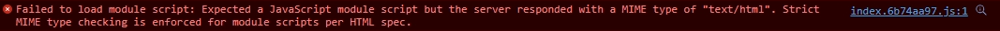

### Brainstorm

所以要如何解決這問題呢？(圖有點小，請見諒)


<br>

```bash
Failed to load module script Expected a JavaScript module script but the server responded with a MIME type of "text/html". Strict MIME type checking is enforced for module scripts per HTML spec.
```

我先用 `npm run preview` 來檢查是否前端打包有問題，其實他間接執行了這段程式碼 `vite preview --port 4173`，這段指令會將打包好的檔案放在 `dist` 資料夾中，並且啟動一個本地端 server，在部署前檢查打包後的內容是否有問題，這邊我確認結果後，發現打包是沒有問題的。

而後台這時也有用以前專案去 host 看看，發現也是可執行的，頁面有正常渲染。

確認不是程式方面的問題，於是我們就根據問題來 debug 後來發現後台 serve 不到我 build 完後的檔案，如圖，也就是 `index.6b74aa97.js` 這檔案，而這原因是 vite 在打包後，會將打包好的資料都全部扔到 `assets` 這統一的的資料夾中，下方式打包後 `dist` 架構圗：

```
.
├── assets/
│   └── index.[hash].js
│   └── foo.[hash].png
│   └── bar.[hash].css
├── favicon.ico
└── index.html
```

而後台程式 serve static 靜態檔案的方式是這要這樣的，他是分別將 js，images 及 css 都分開來進行靜態檔案的處理：

```
.
├── assets/
│   └── js/
│   └── images/
│   └── css/
├── favicon.ico
└── index.html
```

# How to solve

解決該問題的方式有幾種，一種是直接也是最簡單的方式，就是直接將 assets 這資料夾，直接 serve 為靜態檔案，這部分要看各位後端使用什麼語言去做，我就不多做解釋。

另一種則是我前端要去設定 vite 打包後的路徑，並將檔案依據類型分開放置，下方是很簡單的 `vite.config.ts` 的範例：

```ts
// vite.config.ts
import { defineConfig } from 'vite'
import vue from '@vitejs/plugin-vue'
import { resolve } from 'path'

// https://vitejs.dev/config/
export default defineConfig({
  base: '/',
  plugins: [vue()],
  resolve: {
    alias: [
      {
        find: '@',
        replacement: resolve(__dirname, 'src') + '/'
      }
    ]
  },
  build: {
    rollupOptions: {
      output: {
        chunkFileNames: 'assets/js/[name]-[hash].js',
        entryFileNames: 'assets/js/[name]-[hash].js',

        assetFileNames: ({ name }) => {
          if (/\.(gif|jpe?g|png|svg)$/.test(name ?? '')) {
            return 'assets/images/[name]-[hash][extname]'
          }

          if (/\.css$/.test(name ?? '')) {
            return 'assets/css/[name]-[hash][extname]'
          }

          // default value
          // ref: https://rollupjs.org/guide/en/#outputassetfilenames
          return 'assets/[name]-[hash][extname]'
        }
      }
    }
  }
})
```

### Conclusion

當然也有可能是其他情況導致這問題，像是公司需要較高的安全係數，所以可能上傳檔案的大小有限制，間接導致部署時未能將檔案成功部署，而這時開瀏覽器，也會有無法讀取到該檔案這個錯誤訊息出現，這邊只闡述我所遇到的情況，希望能幫助到大家。
