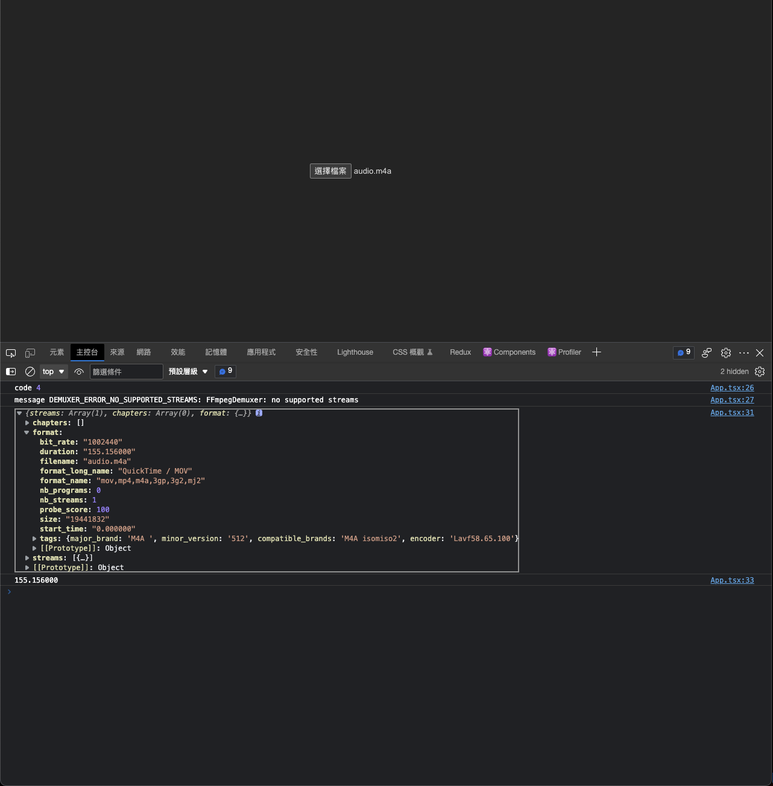

## WebAssembly in read world

最近為何會使用到 wasm 呢？原因是我們要做音檔上傳，那需要做到音檔長度的限制，所以我們需要讀取檔案內的資訊，聽起來頗簡單的齁，但如果該音檔是瀏覽器無法支援的該怎麼辦呢？

```html
<div>
  <video src='./audio.m4a' controls></video>
</div> 

<script>
  (async () => {
    const video = document.querySelector('video')
  
    video.addEventListener('loadedmetadata', () => {
      console.log(video.duration)
    })
  
    // if browser can't support this video, it will throw error
    video.addEventListener('error', (e) => {
      console.log(`code: ${e.target.error.code}`)
      console.log(`message: ${e.target.error.message}`)
    })
  })()
</script>
```

正常情況下我們可以使用 `loadedmetadata` 事件去抓取影音檔的時間，但如果該檔案是瀏覽器無法支援的，錯誤就會透過 `error` 事件顯示出來，錯誤如下：

```bash
code: 4
message: "DEMUXER_ERROR_NO_SUPPORTED_STREAMS: FFmpegDemuxer: no supported streams"
```

## Brainstorming time

所以前端無法使用原生的方式進行影音檔長度驗證，無可奈何之下，前端只能跟後端提說，必須要將檔案上傳到伺服器進行驗證，畢竟後端可以使用 `fs`...等的方式去解析檔案，聽起來還滿合情合理的齁？但是當檔案大小是好幾 GB 時，這個操作是正確的嗎？也就是客戶上傳等了好幾分鐘，最後伺服器回給客戶講說檔案長度太長，這樣的使用者體驗是不是很差呢？

試想如果能讓前端可以直接讀取檔案內容，並且可以取得檔案長度，這樣的話，就可以在客戶上傳前，先驗證檔案長度，如果檔案長度太長，也可以在前端就直接拒絕上傳並告知客戶，不用等待伺服器回應，這樣的體驗是不是很好呢？

## It's showtime

WebAssembly 的優勢就顯現出來了，我們可以使用[ffprobe-wasm 套件](https://www.npmjs.com/package/ffprobe-wasm?activeTab=dependents)，下方是 react 範例：

```tsx
// pnpm create vite react-wasm --template react-ts
import React, { useEffect, ChangeEvent } from 'react'
import './App.css'
import { FFprobeWorker } from 'ffprobe-wasm' // pnpm i ffprobe-wasm

const worker = new FFprobeWorker()

function App() {
  const [file, setFile] = React.useState<File | null>(null)

  const handleFileChange = (e: ChangeEvent<HTMLInputElement>) => {
    setFile(e.target.files?.[0] || null)
  }

  useEffect(() => {
    if (file) {
      const videoEl = document.createElement('video')
      const videoUrl = URL.createObjectURL(file)

      // if error, this method will not trigger
      const handleLoadedMetadata = () => {
        console.log('loaded metadata', videoEl.duration)
      }

      const handleError = async (e: ErrorEvent) => {
        const target = e.target as HTMLVideoElement
        console.log('code', target.error?.code)
        console.log('message', target.error?.message)

        if (target.error?.code === 4) {
          const fileInfo = await worker.getFileInfo(file)
          const duration = fileInfo.format?.duration;
          console.log(duration) // you can get duration here
        }
      }

      videoEl.addEventListener('loadedmetadata', handleLoadedMetadata)
      videoEl.addEventListener('error', handleError)

      videoEl.src = videoUrl

      return () => {
        videoEl.removeEventListener('loadedmetadata', handleLoadedMetadata)
        videoEl.removeEventListener('error', handleError)
      }
    }
  }, [file])

  return (
    <div>
      <input type="file" onChange={handleFileChange} />
    </div>
  )
}

export default App
```


<br>

由於該套件需使用到 `SharedArrayBuffer`，需添加額外的 config，可以參考 [MDN](https://developer.mozilla.org/en-US/docs/Web/JavaScript/Reference/Global_Objects/SharedArrayBuffer)。

基本上，就是要設定 ``"crossOriginEmbedderPolicy": "require-corp"`` 跟 ``"crossOriginOpenerPolicy": "same-origin"``，設定好後，就可以使用了。

```ts
// vite.config.ts
import { defineConfig } from 'vite'
import react from '@vitejs/plugin-react'

// https://vitejs.dev/config/
export default defineConfig({
  plugins: [
    react(),
    {
      name: "configure-response-headers",
      configureServer: (server) => {
        server.middlewares.use((_req, res, next) => {
          res.setHeader("Cross-Origin-Embedder-Policy", "require-corp");
          res.setHeader("Cross-Origin-Opener-Policy", "same-origin");
          next();
        });
    },
  }],
})
```

## Conclusion

我自己認為 wasm 會越來越頻繁並使用在網頁建置上面，以往需要到後端做處理的事情，一部分會慢慢的被前端取代掉，我自己現在也慢慢的在學習 rust yew，相關方面的知識，期許自己持續進步嚕。