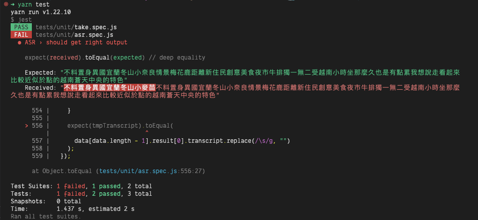
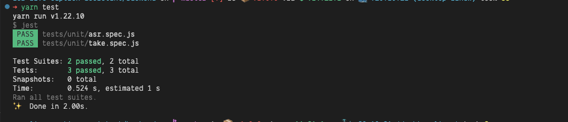

### Preface

ASR 又叫做 Automatic Speech Recognition，是 AI 語音辨識的一個功能，簡單來講就是將人說的話透過 AI 轉換成文字，由於這項功能的出現，可能再過不久，聽打員的工作會慢慢轉型成校稿，畢竟辨識的準確率也逐年攀升。但是不可避免的，還是會出現辨識率很低的情況，大多數這取決於訓練集是否有對該主題進行調教及訓練，而當準確率低時，就需要比較即時的校稿。

### The problem

直接上範例，下面是 ASR 產出的文字，假設下面三組資料就 final 了，就能給聽打員去做修改，這樣的結果是好的，但是現實是他可能要更高的組數才會 final 讓聽打員能修改，那這機制對於聽打員就很不友善了，沒有辦法做比較即時的校稿，這是我們不樂見的，所以該如何解決這問題呢？

_Tip: final 代表 AI 將該句視為辨識完成。_

```js
const data = [
  {
    id: "105f9cff-46e7-49a3-87ce-21b49566c018",
    code: 200,
    message: "轉譯成功",
    result: [
      {
        segment: 16,
        transcript: "不料 這時",
        final: 0,
      },
    ],
  },
  {
    id: "105f9cff-46e7-49a3-87ce-21b49566c018",
    code: 200,
    message: "轉譯成功",
    result: [
      {
        segment: 16,
        transcript: "不料 置身 異國 宜蘭",
        final: 0,
      },
    ],
  },
  {
    id: "105f9cff-46e7-49a3-87ce-21b49566c018",
    code: 200,
    message: "轉譯成功",
    result: [
      {
        segment: 16,
        transcript: "不料 置身 異國 宜蘭 冬山 小麥",
        final: 1,
      },
    ],
  }
]
```

### Brainstorming

在開始腦力激盪之前，首先，我們須先理解 ASR 辨識的機制，目前我們的語音辨識機制是使用 trigram 的方式來進行辨識，也就是一個詞出來他會去解析他的前後的詞，然後透過 AI 進行修改，所以我們可以利用這個特性來解決這個問題，簡而言之就是三詞是一組，但究竟要第個詞才不會影響到原先的三詞呢，下面我會用圖解的方式來進行說明。

```bash
# * 代表一詞

      # 由於三詞一組的機制，第四詞出來後，會影響到前面的第三詞
    |
* * * *
        # 第五詞出來後，只會影響到第四詞，並不會影響到前面的第三詞
      |
* * * * *
```

透過上面的演示，我們可以得知，在句子尚未 final 的情況下，五詞時前面三詞是 final 的，也就是能扔給聽打員進行修改。理解完規則後，接下來就必須驗證功能是否正確，而我相信寫測試在這階段是必不可少的，尤其功能是比較需要邏輯的程式撰寫方面，TDD (Test-Driven Development) 的開發模式就顯得有它的獨到之處，假設我們在腦力激盪這階段的想法是錯的，便能透過後續的測試知道結果是不對的，差異也能直接透過測試碼展現出來，而我自己相當喜歡也鼓勵大家撰寫這種類型的測試，在後續運維當中，測試會慢慢顯示它的價值在。

### Unit test

首先，我們寫了兩組測試分別測試兩個 `takeRight` 及 `take` 這兩個 function 來判定是否有達到我們的需求，順帶一提，lodash 也有提供這個功能。

```js
// take.spec.js
const { take, takeRight } = require('./utils')

describe('take', () => {
  it("can take array value", () => {
    const arr = [1, 2, 3, 4, 5, 6];

    expect(take(arr, 3)).toStrictEqual([1, 2, 3]);
  });

  it("can take right value", () => {
    const arr = [1, 2, 3, 4, 5, 6];

    expect(takeRight(arr, 3)).toStrictEqual([6, 5, 4]);
  });
}), 
```

```js
function take(arr, take = 3) {
  const result = [];
  for (let i = 0; i < take; i++) {
    result.push(arr[i]);
  }

  return result;
}

function takeRight(arr, take = 3) {
  const len = arr.length;
  const result = [];
  for (let i = len - 1; i >= len - take; i--) {
    result.push(arr[i]);
  }

  return result;
}

module.exports = { take, takeRight };
```

下面這組的 unit test 就留給讀者自己完成了，簡單來講就是，將 array 轉換成字串，並且有空格的一個 function。

```js
// getTranscript.js
function getTranscript(arr, len) {
  let str = "";
  const re = /^[A-Za-z0-9]*$/;

  if (arr.length === 0) return str;

  take(arr, len).forEach((w) => {
    if (re.test(w[w.length - 1])) {
      str += ` ${w}`;
    } else {
      str += w;
    }
  });

  return str;
}
```

```js
// getTranscript.spec.js

// your turn ...
```

### Features test

那我們就來寫整個功能的 features 吧，其實我有進行刪減，正常情況下需 mock websocket，但我們簡單一點用僅用 array 資料來模擬。

```js
// ASR.spec.js
const WORDS = 5; // you can try to change this word to 3 and you can see the difference

describe("ASR", () => {
  it("should get right output", () => {
    let previousArr = [];
    let tmpTranscript = "";

    // mimic asr websocket implement situation
    for (let i = 0; i < data.length; i++) {
      if (data[i].code === 200) {
        const { transcript, final } = data[i].result[0];
        const transcriptArr = transcript.split(" ") || [];
        const transcriptArrLength = transcriptArr.length;
        const o = getTranscript(transcriptArr, transcriptArrLength);
        const previousArrLength = previousArr.length;

        if (final === 0) {
          if (transcriptArrLength > WORDS) {
            let t = "";
            const diff = previousArrLength + WORDS - transcriptArrLength;

            if (diff > 0) {
              t = getTranscript(
                transcriptArr,
                transcriptArrLength - WORDS + diff
              );
            } else {
              t = getTranscript(transcriptArr, transcriptArrLength - WORDS);
            }

            if (previousArrLength !== 0) {
              const p = getTranscript(previousArr, previousArrLength);
              const re = new RegExp(p, "i");
              data[i].t = t.replace(re, "");
            } else {
              data[i].t = t;
            }

            if (diff > 0) {
              data[i].tmp = takeRight(transcriptArr, WORDS - diff);
              previousArr = take(
                transcriptArr,
                transcriptArrLength - WORDS + diff
              );
            } else {
              data[i].tmp = takeRight(transcriptArr, WORDS);
              previousArr = take(transcriptArr, transcriptArrLength - WORDS);
            }
          } else {
            // still smaller then WORDS, so ignore previousArr value, because the value might not be correct.
            data[i].t = "";
            data[i].tmp = transcriptArr;
          }
        } else {
          const p = getTranscript(previousArr, previousArrLength);
          const re = new RegExp(p, "i");
          data[i].t = o.replace(re, "");
          data[i].tmp = [];

          previousArr = [];
        }

        // console.log(data[i]);

        tmpTranscript += data[i].t.replace(/\s/g, "");
      }
    }

    expect(tmpTranscript).toEqual(
      data[data.length - 1].result[0].transcript.replace(/\s/g, "")
    );
  });
});
```

附上兩張測試結果的圖片，測試失敗的是我 WORD 設為 3，所以測試是失敗的，通過測試的則是我講 WORD 設為 5 的情況。


<br>

<br>

最後附上兩組超級長的測試資料，可以給讀者實際測試看看。

```js
// sample data

// const data = [
//   {
//     id: "b4fe6d16-906f-4383-b72c-2805a18497c5",
//     code: 200,
//     message: "轉譯成功",
//     result: [
//       {
//         segment: 5,
//         transcript: "企圖 中 對 軍事 設備 最為",
//         final: 0,
//       },
//     ],
//   },
//   {
//     id: "b4fe6d16-906f-4383-b72c-2805a18497c5",
//     code: 200,
//     message: "轉譯成功",
//     result: [
//       {
//         segment: 5,
//         transcript: "企圖 中 對 軍事 設備 最為 重要 的 莫過於",
//         final: 0,
//       },
//     ],
//   },
//   {
//     id: "b4fe6d16-906f-4383-b72c-2805a18497c5",
//     code: 200,
//     message: "轉譯成功",
//     result: [
//       {
//         segment: 5,
//         transcript:
//           "企圖 中 對 軍事 設備 最為 重要 的 莫過於 t 這 個 罕見 疾病",
//         final: 0,
//       },
//     ],
//   },
//   {
//     id: "b4fe6d16-906f-4383-b72c-2805a18497c5",
//     code: 200,
//     message: "轉譯成功",
//     result: [
//       {
//         segment: 5,
//         transcript:
//           "企圖 中 對 軍事 設備 最為 重要 的 莫過於 t 這 個 罕見 資源 包含",
//         final: 0,
//       },
//     ],
//   },
//   {
//     id: "b4fe6d16-906f-4383-b72c-2805a18497c5",
//     code: 200,
//     message: "轉譯成功",
//     result: [
//       {
//         segment: 5,
//         transcript:
//           "企圖 中 對 軍事 設備 最為 重要 的 莫過於 t 這 個 罕見 資源 包含 炸藥 和 武器 以及",
//         final: 0,
//       },
//     ],
//   },
//   {
//     id: "b4fe6d16-906f-4383-b72c-2805a18497c5",
//     code: 200,
//     message: "轉譯成功",
//     result: [
//       {
//         segment: 5,
//         transcript:
//           "企圖 中 對 軍事 設備 最為 重要 的 莫過於 t 這 個 罕見 資源 包含 炸藥 和 武器 以及 夜視鏡 等",
//         final: 0,
//       },
//     ],
//   },
//   {
//     id: "b4fe6d16-906f-4383-b72c-2805a18497c5",
//     code: 200,
//     message: "轉譯成功",
//     result: [
//       {
//         segment: 5,
//         transcript:
//           "企圖 中 對 軍事 設備 最為 重要 的 莫過於 t 這 個 罕見 資源 包含 炸藥 和 武器 以及 夜視鏡 等 都 需要 替",
//         final: 0,
//       },
//     ],
//   },
//   {
//     id: "b4fe6d16-906f-4383-b72c-2805a18497c5",
//     code: 200,
//     message: "轉譯成功",
//     result: [
//       {
//         segment: 5,
//         transcript:
//           "企圖 中 對 軍事 設備 最為 重要 的 莫過於 t 這 個 罕見 資源 包含 炸藥 和 武器 以及 夜視鏡 等 都 需要 替 二零一九年",
//         final: 0,
//       },
//     ],
//   },
//   {
//     id: "b4fe6d16-906f-4383-b72c-2805a18497c5",
//     code: 200,
//     message: "轉譯成功",
//     result: [
//       {
//         segment: 5,
//         transcript:
//           "企圖 中 對 軍事 設備 最為 重要 的 莫過於 t 這 個 罕見 資源 包含 炸藥 和 武器 以及 夜視鏡 等 都 需要 替 二零一九年 我國 的 金屬 梯",
//         final: 0,
//       },
//     ],
//   },
//   {
//     id: "b4fe6d16-906f-4383-b72c-2805a18497c5",
//     code: 200,
//     message: "轉譯成功",
//     result: [
//       {
//         segment: 5,
//         transcript:
//           "企圖 中 對 軍事 設備 最為 重要 的 莫過於 t 這 個 罕見 資源 包含 炸藥 和 武器 以及 夜視鏡 等 都 需要 替 二零一九年 我國 的 金屬 銻 產量 上升 到 了 十",
//         final: 0,
//       },
//     ],
//   },
//   {
//     id: "b4fe6d16-906f-4383-b72c-2805a18497c5",
//     code: 200,
//     message: "轉譯成功",
//     result: [
//       {
//         segment: 5,
//         transcript:
//           "企圖 中 對 軍事 設備 最為 重要 的 莫過於 t 這 個 罕見 資源 包含 炸藥 和 武器 以及 夜視鏡 等 都 需要 替 二零一九年 我國 的 金屬 銻 產量 上升 到 了 十萬 人 這",
//         final: 0,
//       },
//     ],
//   },
//   {
//     id: "b4fe6d16-906f-4383-b72c-2805a18497c5",
//     code: 200,
//     message: "轉譯成功",
//     result: [
//       {
//         segment: 5,
//         transcript:
//           "企圖 中 對 軍事 設備 最為 重要 的 莫過於 t 這 個 罕見 資源 包含 炸藥 和 武器 以及 夜視鏡 等 都 需要 替 二零一九年 我國 的 金屬 銻 產量 上升 到 了 十萬 人 這 其中 貢獻 最 大",
//         final: 0,
//       },
//     ],
//   },
//   {
//     id: "b4fe6d16-906f-4383-b72c-2805a18497c5",
//     code: 200,
//     message: "轉譯成功",
//     result: [
//       {
//         segment: 5,
//         transcript:
//           "企圖 中 對 軍事 設備 最為 重要 的 莫過於 t 這 個 罕見 資源 包含 炸藥 和 武器 以及 夜視鏡 等 都 需要 替 二零一九年 我國 的 金屬 銻 產量 上升 到 了 十萬 人 這 其中 貢獻 最 大 的 就 是 有 t",
//         final: 0,
//       },
//     ],
//   },
//   {
//     id: "b4fe6d16-906f-4383-b72c-2805a18497c5",
//     code: 200,
//     message: "轉譯成功",
//     result: [
//       {
//         segment: 5,
//         transcript:
//           "企圖 中 對 軍事 設備 最為 重要 的 莫過於 t 這 個 罕見 資源 包含 炸藥 和 武器 以及 夜視鏡 等 都 需要 替 二零一九年 我國 的 金屬 銻 產量 上升 到 了 十萬 人 這 其中 貢獻 最 大 的 就 是 有 梯度 磁場 的 錫礦",
//         final: 0,
//       },
//     ],
//   },
//   {
//     id: "b4fe6d16-906f-4383-b72c-2805a18497c5",
//     code: 200,
//     message: "轉譯成功",
//     result: [
//       {
//         segment: 5,
//         transcript:
//           "企圖 中 對 軍事 設備 最為 重要 的 莫過於 t 這 個 罕見 資源 包含 炸藥 和 武器 以及 夜視鏡 等 都 需要 替 二零一九年 我國 的 金屬 銻 產量 上升 到 了 十萬 人 這 其中 貢獻 最 大 的 就 是 有 梯度 磁場 錫礦山",
//         final: 0,
//       },
//     ],
//   },
//   {
//     id: "b4fe6d16-906f-4383-b72c-2805a18497c5",
//     code: 200,
//     message: "轉譯成功",
//     result: [
//       {
//         segment: 5,
//         transcript:
//           "企圖 中 對 軍事 設備 最為 重要 的 莫過於 t 這 個 罕見 資源 包含 炸藥 和 武器 以及 夜視鏡 等 都 需要 替 二零一九年 我國 的 金屬 銻 產量 上升 到 了 十萬 人 這 其中 貢獻 最 大 的 就 是 有 梯度 磁場 錫礦山 替 資源 相當 珍貴",
//         final: 0,
//       },
//     ],
//   },
//   {
//     id: "b4fe6d16-906f-4383-b72c-2805a18497c5",
//     code: 200,
//     message: "轉譯成功",
//     result: [
//       {
//         segment: 5,
//         transcript:
//           "企圖 中 對 軍事 設備 最為 重要 的 莫過於 t 這 個 罕見 資源 包含 炸藥 和 武器 以及 夜視鏡 等 都 需要 替 二零一九年 我國 的 金屬 銻 產量 上升 到 了 十萬 人 這 其中 貢獻 最 大 的 就 是 有 梯度 磁場 錫礦山 替 資源 相當 珍貴 全球 只有 一",
//         final: 0,
//       },
//     ],
//   },
//   {
//     id: "b4fe6d16-906f-4383-b72c-2805a18497c5",
//     code: 200,
//     message: "轉譯成功",
//     result: [
//       {
//         segment: 5,
//         transcript:
//           "企圖 中 對 軍事 設備 最為 重要 的 莫過於 t 這 個 罕見 資源 包含 炸藥 和 武器 以及 夜視鏡 等 都 需要 替 二零一九年 我國 的 金屬 銻 產量 上升 到 了 十萬 人 這 其中 貢獻 最 大 的 就 是 有 梯度 磁場 錫礦山 替 資源 相當 珍貴 全球 只有 一百 八十 多萬 噸",
//         final: 0,
//       },
//     ],
//   },
//   {
//     id: "b4fe6d16-906f-4383-b72c-2805a18497c5",
//     code: 200,
//     message: "轉譯成功",
//     result: [
//       {
//         segment: 5,
//         transcript:
//           "企圖 中 對 軍事 設備 最為 重要 的 莫過於 t 這 個 罕見 資源 包含 炸藥 和 武器 以及 夜視鏡 等 都 需要 替 二零一九年 我國 的 金屬 銻 產量 上升 到 了 十萬 人 這 其中 貢獻 最 大 的 就 是 有 梯度 磁場 錫礦山 替 資源 相當 珍貴 全球 只有 一百 八十 多萬 噸 但 中國 卻",
//         final: 0,
//       },
//     ],
//   },
//   {
//     id: "b4fe6d16-906f-4383-b72c-2805a18497c5",
//     code: 200,
//     message: "轉譯成功",
//     result: [
//       {
//         segment: 5,
//         transcript:
//           "企圖 中 對 軍事 設備 最為 重要 的 莫過於 t 這 個 罕見 資源 包含 炸藥 和 武器 以及 夜視鏡 等 都 需要 替 二零一九年 我國 的 金屬 銻 產量 上升 到 了 十萬 人 這 其中 貢獻 最 大 的 就 是 有 梯度 磁場 錫礦山 替 資源 相當 珍貴 全球 只有 一百 八十 多萬 噸 但 中國 卻 掌握 了 九十五",
//         final: 1,
//         startTime: 87.78,
//         endTime: 108.78,
//       },
//     ],
//   },
// ];

const data = [
  {
    id: "105f9cff-46e7-49a3-87ce-21b49566c018",
    code: 200,
    message: "轉譯成功",
    result: [
      {
        segment: 16,
        transcript: "不料 這時",
        final: 0,
      },
    ],
  },
  {
    id: "105f9cff-46e7-49a3-87ce-21b49566c018",
    code: 200,
    message: "轉譯成功",
    result: [
      {
        segment: 16,
        transcript: "不料 置身 異國 宜蘭",
        final: 0,
      },
    ],
  },
  {
    id: "105f9cff-46e7-49a3-87ce-21b49566c018",
    code: 200,
    message: "轉譯成功",
    result: [
      {
        segment: 16,
        transcript: "不料 置身 異國 宜蘭 冬山 小麥",
        final: 0,
      },
    ],
  },
  {
    id: "105f9cff-46e7-49a3-87ce-21b49566c018",
    code: 200,
    message: "轉譯成功",
    result: [
      {
        segment: 16,
        transcript: "不料 置身 異國 宜蘭 冬山 小麥 苗 情 警容 風紀",
        final: 0,
      },
    ],
  },
  {
    id: "105f9cff-46e7-49a3-87ce-21b49566c018",
    code: 200,
    message: "轉譯成功",
    result: [
      {
        segment: 16,
        transcript: "不料 置身 異國 宜蘭 冬山 小 奈良 情景 梅花鹿 距離",
        final: 0,
      },
    ],
  },
  {
    id: "105f9cff-46e7-49a3-87ce-21b49566c018",
    code: 200,
    message: "轉譯成功",
    result: [
      {
        segment: 16,
        transcript:
          "不料 置身 異國 宜蘭 冬山 小 奈良 情景 梅花鹿 距離 新住民 創意",
        final: 0,
      },
    ],
  },
  {
    id: "105f9cff-46e7-49a3-87ce-21b49566c018",
    code: 200,
    message: "轉譯成功",
    result: [
      {
        segment: 16,
        transcript:
          "不料 置身 異國 宜蘭 冬山 小 奈良 情景 梅花鹿 距離 新住民 創意 美食 夜市 牛排",
        final: 0,
      },
    ],
  },
  {
    id: "105f9cff-46e7-49a3-87ce-21b49566c018",
    code: 200,
    message: "轉譯成功",
    result: [
      {
        segment: 16,
        transcript:
          "不料 置身 異國 宜蘭 冬山 小 奈良 情景 梅花鹿 距離 新住民 創意 美食 夜市 牛排 獨一無二",
        final: 0,
      },
    ],
  },
  {
    id: "105f9cff-46e7-49a3-87ce-21b49566c018",
    code: 200,
    message: "轉譯成功",
    result: [
      {
        segment: 16,
        transcript:
          "不料 置身 異國 宜蘭 冬山 小 奈良 情景 梅花鹿 距離 新住民 創意 美食 夜市 牛排 獨一無二 受 越南",
        final: 0,
      },
    ],
  },
  {
    id: "105f9cff-46e7-49a3-87ce-21b49566c018",
    code: 200,
    message: "轉譯成功",
    result: [
      {
        segment: 16,
        transcript:
          "不料 置身 異國 宜蘭 冬山 小 奈良 情景 梅花鹿 距離 新住民 創意 美食 夜市 牛排 獨一無二 受 越南 小時 坐 那麼 久",
        final: 0,
      },
    ],
  },
  {
    id: "105f9cff-46e7-49a3-87ce-21b49566c018",
    code: 200,
    message: "轉譯成功",
    result: [
      {
        segment: 16,
        transcript:
          "不料 置身 異國 宜蘭 冬山 小 奈良 情景 梅花鹿 距離 新住民 創意 美食 夜市 牛排 獨一無二 受 越南 小時 坐 那麼 久 也 是 有點 累",
        final: 0,
      },
    ],
  },
  {
    id: "105f9cff-46e7-49a3-87ce-21b49566c018",
    code: 200,
    message: "轉譯成功",
    result: [
      {
        segment: 16,
        transcript:
          "不料 置身 異國 宜蘭 冬山 小 奈良 情景 梅花鹿 距離 新住民 創意 美食 夜市 牛排 獨一無二 受 越南 小時 坐 那麼 久 也 是 有點 累 我 想說",
        final: 0,
      },
    ],
  },
  {
    id: "105f9cff-46e7-49a3-87ce-21b49566c018",
    code: 200,
    message: "轉譯成功",
    result: [
      {
        segment: 16,
        transcript:
          "不料 置身 異國 宜蘭 冬山 小 奈良 情景 梅花鹿 距離 新住民 創意 美食 夜市 牛排 獨一無二 受 越南 小時 坐 那麼 久 也 是 有點 累 我 想說 走",
        final: 0,
      },
    ],
  },
  {
    id: "105f9cff-46e7-49a3-87ce-21b49566c018",
    code: 200,
    message: "轉譯成功",
    result: [
      {
        segment: 16,
        transcript:
          "不料 置身 異國 宜蘭 冬山 小 奈良 情景 梅花鹿 距離 新住民 創意 美食 夜市 牛排 獨一無二 受 越南 小時 坐 那麼 久 也 是 有點 累 我 想說 走 看起來 比較 政治",
        final: 0,
      },
    ],
  },
  {
    id: "105f9cff-46e7-49a3-87ce-21b49566c018",
    code: 200,
    message: "轉譯成功",
    result: [
      {
        segment: 16,
        transcript:
          "不料 置身 異國 宜蘭 冬山 小 奈良 情景 梅花鹿 距離 新住民 創意 美食 夜市 牛排 獨一無二 受 越南 小時 坐 那麼 久 也 是 有點 累 我 想說 走 看起來 比較 近似 於 點 的",
        final: 0,
      },
    ],
  },
  {
    id: "105f9cff-46e7-49a3-87ce-21b49566c018",
    code: 200,
    message: "轉譯成功",
    result: [
      {
        segment: 16,
        transcript:
          "不料 置身 異國 宜蘭 冬山 小 奈良 情景 梅花鹿 距離 新住民 創意 美食 夜市 牛排 獨一無二 受 越南 小時 坐 那麼 久 也 是 有點 累 我 想說 走 看起來 比較 近似 於 點 的 越南 藏",
        final: 0,
      },
    ],
  },
  {
    id: "105f9cff-46e7-49a3-87ce-21b49566c018",
    code: 200,
    message: "轉譯成功",
    result: [
      {
        segment: 16,
        transcript:
          "不料 置身 異國 宜蘭 冬山 小 奈良 情景 梅花鹿 距離 新住民 創意 美食 夜市 牛排 獨一無二 受 越南 小時 坐 那麼 久 也 是 有點 累 我 想說 走 看起來 比較 近似 於 點 的 越南 蒼 天 中央 的 特色",
        final: 1,
        startTime: 129.78,
        endTime: 150.78,
      },
    ],
  },
];
```

### Conclusion

其實這專案已經完成很久了，只是我現在才將它寫成一篇文章，老實講這專案還頗複雜的，由於公司服務是 docker base 的，所以要先搞定 docker，資料庫使用 docker network 的方式連接，撰寫前台介面跟要撰寫一個類似 bridge 的後端服務負責溝通前台及 ASR，又要讓聽打員能修改並儲存到資料庫中，處理 ASR websocket 的資料，及前台的資料需要即時能跟後台進行同步...等，好在最後都能順利解決😅。

那這篇文章主要是想闡述我認為測試在這種需要撰寫邏輯的程式碼時，是相當重要的，他能為後續運維帶來正向的效應，像是之後 ASR 功能有得到顯著的提升，或許不使用 trigram，我們則需要將 WORD 調整到適合的位置上就能進行快速測試，相當方便，希望這篇文章能對你有所收穫。
